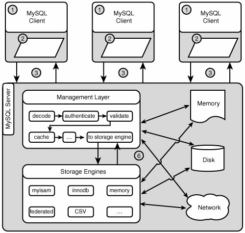
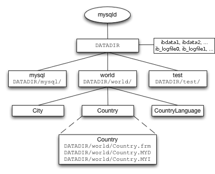

ADMINISTRACIÓN DE MYSQL 5
=========================

{toc}

---

FUNCIONES DEL ADMINISTRADOR/A
-----------------------------

Las funciones de un administrador de bases de datos son:

 * Gestión del software:
   - instalación del software,
   - actualización del software,
   - conexión de programas (por ej. ofimática) con el servidor de bases de datos.

 * Gestión de las bases de datos:
   - creación de bases de datos,
   - importación y exportación de datos,
   - copias de seguridad y recuperación,
   - optimización de las tablas,
   - análisis de la integridad y reparación.

 * Gestión de los usuarios:
   - creación de usuarios y bajas,
   - asignación de permisos.

 * Gestión de los recursos:
   - monitorización del rendimiento y el tamaño,
   - gestión del espacio y asignación de quotas,
   - configuración óptima del servidor.

 * Gestión de la seguridad:
   - monitorización de los accesos,
   - configuración segura del servidor.

---

INSTALACIÓN DE MYSQL 5.0 EN UBUNTU 7.04
---------------------------------------

 * Instalaremos los paquetes *mysql-server* y *mysql-client*.

   Opcionalmente podemos instalar los paquetes *mysql-admin*, que es un entorno gráfico de administración, y *mysql-query-browser*, que es un entorno gráfico para realizar consultas.

 * La instalación crea en el sistema el usuario *mysql* y el grupo *mysql*.

 * La instalación crea en el servidor de bases de datos el usuario *root* sin contraseña, que tiene control total sobre todas las bases de datos del servidor. Para ponerle contraseña debemos escribir en la línea de comandos:

       mysqladmin -u root password <nueva_contraseña>

   En algunas instalaciones también existe un usuario anónimo '' sin contraseña, propietario de la base de datos de prueba *test*.

   En versiones posteriores de Ubuntu, la contraseña del usuario *root* se solicita en el momento de la instalación.

   Los usuarios de la base de datos no tienen nada que ver con los usuarios del sistema operativo.

 * Por defecto hay una base de datos *mysql* con información de MySQL y usuarios, y otra base de datos *information_schema* con información de todas las otras bases de datos.

 * Ficheros y directorios importantes (pueden variar en otras instalaciones):

   - /var/lib/mysql/

     Guarda las bases de datos del servidor.

     A cada base de datos corresponderá un directorio con el mismo nombre.

     A cada tabla MyISAM corresponderán varios ficheros con el mismo nombre que la tabla y diferente extensión (*.frm = formato, *.myd = datos tablas, *.myi = índices) dentro de un directorio con el mismo nombre que su base de datos.

     A cada tabla InnoDB corresponderán un fichero con el mismo nombre que la tabla y extensión .frm (formato) dentro de un directorio con el mismo nombre que su base de datos, y varios ficheros con nombre *ibdata1*, *ibdata2*, ... ("tablespace") que compartirá con otras bases de datos en el directorio principal de datos.

     El propietario de los ficheros es el usuario *mysql* y el grupo *mysql*.

   - /var/log/mysql/

     Anotaciones y alertas del servidor.

   - /etc/mysql/

     Ficheros de configuración general (my.cnf). Cada vez que cambiemos la configuración deberemos reiniciar el servidor para que se activen los nuevos cambios.

   - /etc/init.d/mysql

     Script para arrancar, parar y reiniciar el servidor

   - /usr/bin/ , /usr/sbin/ , /usr/share/mysql/

     Programas de MySQL

 * Se puede iniciar la ejecución de varias maneras:

       sudo systemctl start mysql
       sudo /usr/sbin/mysql start
       sudo /usr/bin/mysqld-multi
       sudo /usr/bin/mysqld-safe

 * Se puede parar la ejecución de varias maneras:

       sudo systemctl stop mysql
       sudo /usr/sbin/mysql stop
       mysqladmin -u root -p shutdown

 * El puerto por defecto del servidor MySQL es el TCP/UDP 3306.

 * Para acceder remotamente al servidor debemos modificar /etc/mysql/my.cnf , comentando la línea `bind-address` o la línea `skip-networking`

 * Si queremos los mensajes en otro idioma debemos modificar /etc/mysql/my.cnf y cambiar la línea `[mysqld] language = `. Por ejemplo `laguage = spanish`.

 * Lecturas para profundizar:

   - <http://dev.mysql.com/doc/refman/5.7/en/server-side-scripts.html>
   - <http://dev.mysql.com/doc/refman/5.7/en/instance-manager.html>
   - <http://dev.mysql.com/doc/refman/5.7/en/configuring-mysql.html>
   - <http://dev.mysql.com/doc/refman/5.7/en/server-shutdown.html>
   - <http://dev.mysql.com/doc/refman/5.7/en/security.html>
   - <http://dev.mysql.com/doc/refman/5.7/en/mysql.html>
   - <http://dev.mysql.com/doc/refman/5.7/en/mysqladmin.html>

---

INSTALACIÓN DE LA BASE DE DATOS DE EJEMPLO
------------------------------------------

Para las diferentes pruebas que haremos necesitaremos una base de datos. Podemos descargar una sencilla base de datos con tres tablas en:

  <http://downloads.mysql.com/docs/world.sql.gz>

Opcionalmente, también se puede descargar otra base de datos más compleja, con más tablas, vistas, procedimientos almacenados, triggers, etc. en:

  <http://downloads.mysql.com/docs/sakila-db.tar.gz>

Para trabajar con la base de datos *world* haremos lo siguiente:

1) Descomprimirla en nuestra carpeta personal. Obtendremos un fichero *world.sql* con sentencias SQL que al ejecutarlo en el servidor creará las tablas de la base de datos.

2) Iniciar el cliente de MySQL:

       mysql [-h dirección_servidor] -p -u usuario base_datos [< fichero_sql]

   En nuestro caso:

       mysql -p -u root

3) Creamos la base de datos y la seleccionamos:

       CREATE DATABASE world;
       USE world;

4) Ejecutamos el fichero *world.sql*:

       SOURCE world.sql;

Fuera del cliente MySQL, desde la cónsola, podemos comprobar que se ha creado un directorio para la base de datos y los ficheros para las tablas:

    sudo ls -l /var/lib/mysql
    sudo ls -l /var/lib/mysql/world

---

FUNCIONAMIENTO DEL SERVIDOR MYSQL
---------------------------------

 * Funcionamiento:

   1) Los clientes se conectan a servidor.

   2) Los clientes inician autentificación, codifican y envían peticiones, comprimen y cifran peticiones, cachean los resultados del servidor, ...

   3) El servidor procesa las peticiones y devuelve las respuestas.

   4) Las peticiones son procesadas primero por la capa de manipulación, que las desencripta, valida su sintaxis, las busca en la caché, y las envía al correspondiente motor de almacenamiento.

   5) Los motores de almacenamiento (MyISAM, InnoDB, Memory, ...) manejan la representación en memoria y disco de bases de datos, tablas e índices, así como generación de estadísticas y algunos logs.

   6) La capa de manejo escribe logs a disco, guarda y lee caches en memoria, lee logs binarios de la red, ...
   
      Los motores de almacenamiento guardan datos (tablas, logs, ...) en disco y en memoria, envía datos a otros servidores remotos, ...

   

 * El servidor MySQL utiliza espacio en disco para almacenar lo siguiente:
   - Los programas cliente y servidor, y sus librerías.
   - Los ficheros de registro ("logs") y de estado.
   - Las bases de datos.
   - Los ficheros de formato de tablas ('*.frm') para todos los motores de almacenamiento, y los ficheros de datos y ficheros de índices para algunos motores de almacenamiento.
   - Los ficheros de "tablespaces" de InnoDB, si el motor de almacenamiento InnoDB está activado.
   - Tablas temporales internas que han sobrepasado el límite de tamaño en memoria y deben ser convertidas a tablas en disco.

 * El servidor MySQL utiliza espacio en memoria para almacenar lo siguiente:
   - Gestores de conexión (cada conexión consume memoria).
   - Buffers que guardan tablas temporales internas que no han sobrepasado el límite de tamaño en memoria.
   - Cachés: caché de hosts, la caché de tablas, la caché de consultas, ...
   - Una copia de la tabla de permisos.
   - El contenido de las tablas HEAP (motor de almacenamiento en memoria). Su fichero de formato ('*.frm') se continua guardando en disco.

 * El servidor MySQL utiliza los siguientes buffers por cada cliente:
   - Buffers de registros para las búsquedas secuenciales en tablas ('read_buffer_size') y para leer las líneas después de una ordenación ('read_rnd_buffer_size') normalmente conseguida mediante la cláusula ORDER.
   - Buffer de join para las uniones de tablas.
   - Buffer de ordenación para las operaciones de ordenación.
   - Buffer de comunicaciones para intercambiar información con el cliente. Comienza con un tamaño de 'net_buffer_length', pero si es necesario el servidor aumenta su tamaño al señalado por 'max_allowed_packet'.

 * Los límites que el sistema operativo puede imponer al servidor MySQL son:
   - El máximo número de ficheros abiertos por proceso limita el tamaño máximo de la caché de tablas, que guarda los descriptores de ficheros para los ficheros de tablas.
   - El máximo número de hilos de ejecución por proceso limita el número de clientes que se pueden conectar simultáneamente al servidor MySQL.
   - El 'backlog' permitido por el sistema limita el número de conexiones de red en cola debido a clientes que esperan a conectarse.
   - El sistema de ficheros donde se guardan los datos limita el tamaño máximo del fichero, pero este límite puede esquivarse repartiendo los datos en varios ficheros.

 * Para registrar los errores podemos iniciar el servidor mediante `mysqld_safe`. Para ver los errores debemos buscar un fichero en el directorio de datos con el nombre de la máquina y con el sufijo '.err'.
	
 * Para registrar las modificaciones de datos de las tablas podemos iniciar el servidor con la opción `--log-bin`. Para ver dicho registro se utiliza la herramienta *mysqlbinlog*.

 * Ver la actividad del servidor:

       mysql>  SHOW STATUS;
       shell>  mysqladmin extended-status

 * Ver la configuración del servidor:

       mysql>  SHOW VARIABLES;
       shell>  mysqladmin variables

 * Lecturas para profundizar:

   - <http://dev.mysql.com/doc/refman/5.7/en/features.html>
   - <http://dev.mysql.com/doc/refman/5.7/en/log-files.html>

---

MOTORES DE ALMACENAMIENTO
-------------------------

 * El servidor MySQL incorpora una característica única llamada "motores de almacenamiento", que nos permite seleccionar el tipo de almacenamiento interno de cada tabla, en base al que mejor se adecúe a una situación particular. Dicha selección, la hace el desarrollador a nivel de tabla, y no afecta a la manera en que el servidor interactúa con el cliente: los comandos SQL serán los mismos sea cual sea el motor de almacenamiento escogido. El cliente no necesita saber como se guardan los datos.

   MySQL dispone de una docena de motores de almacenamiento propios, más los motores externos desarrollados por terceras partes que se pueden incorporar al servidor. Algunos de los más conocidos son: MyISAM, InnoDB, HEAP, NDB.
   
   

 * Seleccionar el motor de almacenamiento de una tabla:

       CREATE TABLE nombre_tabla (definición) ENGINE = nombre_motor;
       ALTER TABLE nombre_tabla ENGINE = nombre_motor;

   Ejemplos:

       CREATE TABLE City (...) ENGINE=InnoDB;
       ALTER TABLE City ENGINE=MyISAM;

 * Caractrísticas del motor MyISAM:
   - No transaccional.
   - Bloqueos a nivel de tabla.
   - Muy rápido en lectura y escritura (excepto escrituras simultaneas en la misma tabla).
   - Bajo requerimiento de espacio en disco y memoria.
   - Los datos se guardan en disco: diferentes ficheros para la definición de la tabla, los datos y los índices.
   - Es el motor por defecto de MySQL.
   - Es una buena elección cuando necesitamos velocidad, y tenemos pocas modificaciones simultaneas de la tabla.

 * Caractrísticas del motor InnoDB: 
   - Transaccional.
   - Multiversionado: cuando múltiples transacciones modifican registros, InnoDB mantiene aisladas las transacciones guardando para cada una de ellas un versión distinta de un mismo registro, a cada transacción la versión que le corresponde.
   - Bloqueos a nivel de registro.
   - Restricciones en claves foráneas.
   - Fácil recuperación de datos en caso de error.
   - Alta concurrencia más segura en escritura.
   - Deshacer transacciones a medias ("rollback").
   - Los datos se guardan en disco: un fichero para la definición de la tabla, y un "tablespace" para guardar conjuntamente datos e índices. El tablespace puede consistir en uno o más ficheros, o incluso una partición entera en disco.
   - Podemos especificar como crecen los tablespaces en el fichero de configuracion /etc/mysql/my.cnf. Por ejemplo:
         [mysqld]
         innodb_data_file_path = ibdata1:100M;ibdata2:100M:autoextend:max:500M
   - Necesita mas espacio en disco y memoria que MyISAM para guardar los datos (unas tres veces mas de espacio en disco, y montones de RAM para las memorias temporales si queremos conseguir un rendimiento óptimo).
   - Es una buena elección cuando necesitamos transacciones, restricciones en claves foráneas, o tenemos muchas escrituras simultaneas.

 * Caractrísticas del motor HEAP:
   - Los datos se guardan en memoria, utilizando algoritmos que hacen un uso óptimo de este medio.
   - Es muy, muy rápido.
   - Podemos crear una tabla HEAP a partir de una tabla en disco con:
         CREATE TABLE nombre_tabla ENGINE=MEMORY SELECT * FROM nombre_tabla_disco;
   - Es una buena elección cuando necesitamos realizar operaciones muy rápidas sobre conjuntos pequeños de datos.

 * Caractrísticas del motor NDB:
   - Es el motor de almacenamiento de los clúster de MySQL. 
   - La base de datos esta repartida por los diferentes nodos del clúster.
   - Proporciona alta disponibilidad mediante redundancia.
   - Proporciona alto rendimiento mediante fragmentación de datos sobre los grupos de nodos.
   - Proporciona alta escalabilidad mediante la combinación de las dos características anteriores.
   - Los datos se guardan en memoria, pero los logs van a disco.
   - Es una buena elección cuando disponiendo de varios servidores necesitamos a la vez velocidad, transacciones y redundancia de datos; replicación síncrona; y resistencia a caídas de servidores.

 * Comparación de los motores:
   |                                         |  MyISAM  |  InnoDB  |  HEAP  |  NDB  |
   | --------------------------------------- |:--------:|:--------:|:------:|:-----:|
   | Multi-statement transactions, ROLLBACK  |       -  |       X  |     -  |    X  |
   | Foreign key constraints                 |       -  |       X  |     -  |    -  |
   | Locking level                           |   table  |     row  | table  |  row  |
   | BTREE indexes                           |       X  |       X  |     -  |    X  |
   | FULLTEXT indexes                        |       X  |       -  |     -  |    -  |
   | HASH lookups                            |       -  |       X  |     X  |    X  |
   | Other in-memory tree-based index        |       -  |       -  | 4.1.0  |    -  |
   | GIS, RTREE indexes                      |   4.1.0  |       -  |     -  |    -  |
   | Unicode                                 |   4.1.0  |   4.1.2  |     -  |    -  |
   | Merge (union views)                     |       X  |       -  |     -  |    -  |
   | Compress read-only storage              |       X  |       -  |     -  |    -  |
   | Relative disk use                       |     low  |    high  |     -  |  low  |
   | Relative memory use                     |     low  |    high  |   low  | high  |

 * Podemos deshabilitar los motores de almacenamiento que no necesitamos para ahorrar memoria del servidor, ya que no necesitaremos reservar memoria para los buffers y otras estructuras de datos asociadas con el motor. Por ejemplo:

       mysqld --skip-bdb --skip-innodb

 * Lecturas para profundizar:

   - <http://dev.mysql.com/doc/refman/5.7/en/storage-engines.html>
   - <http://dev.mysql.com/doc/refman/5.7/en/myisam-storage-engine.html>
   - <http://dev.mysql.com/doc/refman/5.7/en/innodb.html>

---

REPASO DE CONSULTAS
-------------------

 * Listados:
 
       SELECT columnas FROM tabla [WHERE condición]
         [GROUP BY columna [ HAVING condición ]]
         [ORDER BY columna [ ASC | DESC ]]
         [LIMIT [inicio,] num_registros]

     (Se puede usar el comodín * para seleccionar todas las columnas)

   Ejemplos:

       SELECT * FROM City;
  
       SELECT Name, Population FROM City
         WHERE CountryCode='ESP' AND Population > 500000 LIMIT 0,10;

       SELECT CountryCode, SUM(Population) FROM City
         GROUP BY CountryCode HAVING SUM(Population) > 10000000;

       SELECT City.Name, Country.Name FROM City, Country
         WHERE City.CountryCode=Country.Code ORDER BY Country.Name;

 * Borrado:

       DELETE FROM tabla WHERE condición;

   Ejemplos:

       DELETE FROM City WHERE Name='Marbella';

       DELETE FROM City WHERE CountryCode='ESP' AND Population>500000;

 * Inserción: 

       INSERT INTO tabla (columna1, columna2, ...) VALUES (valor1, valor2, ...);

   Ejemplos:

       INSERT INTO City (Name, CountryCode, District, Population)
         VALUES ('JoanBrossa','ESP', 'Katalonia', 3500000);

       INSERT INTO City SET Name='JoanBrossa', CountryCode='ESP',
         District='Katalonia', Population=3500000;

 * Modificación:

       UPDATE tabla SET columna1=valor1, columna2=valor2, ... [WHERE condición];

   Ejemplos:

       UPDATE City SET Population=5000000 WHERE Name='JoanBrossa';

       UPDATE City SET Population=5000000 WHERE Population>1000000;

 * clausula FROM:
 
   Especifica la tabla de la cual se seleccionan los registros

 * clausula WHERE:
 
   Detalla las condiciones que han de reunir los registros resultantes

 * clausula GROUP BY:
 
   Separa los registros seleccionados en grupos específicos

 * clausula HAVING:

   Expresa la condición que debe cumplir cada grupo

 * clausula ORDER BY:

   Ordena los registros seleccionados de acuerdo a una ordenación específica

 * clausula LIMIT:

   Restringe el número de resultados devueltos.

 * Lecturas para profundizar:

   - <http://dev.mysql.com/doc/refman/5.7/en/data-manipulation.html>
   - <http://dev.mysql.com/doc/refman/5.7/en/examples.html>
   - <http://dev.mysql.com/doc/refman/5.7/en/query-speed.html>

---

ADMINISTRACIÓN DE TABLAS Y BASES DE DATOS
-----------------------------------------

 * Crear una nueva base de datos:
 
       CREATE DATABASE nueva_base_datos;

 * Borrar toda una base de datos:

       DROP DATABASE base_datos;

 * Ver las bases de datos del sistema:

       SHOW DATABASES;

 * Seleccionar una base de datos para trabajar con ella:

       USE base_datos;

 * Crear una nueva tabla:

       CREATE TABLE tabla definición;

   Sintaxis completa en <http://dev.mysql.com/doc/refman/5.7/en/create-table.html>

 * Borrar toda una tabla:

       DROP TABLE tabla;

 * Cambiar la definición de una tabla:

       ALTER TABLE tabla modificación;

   Sintaxis completa en <http://dev.mysql.com/doc/refman/5.7/en/alter-table.html>

 * Ver las tablas de una base de datos:

       SHOW TABLES;

 * Ver la descripción de los campos de una tabla:

       DESCRIBE tabla;

 * Bloquea una tabla y sólo deja leer a quien la bloqueo y al resto de usuarios:

       LOCK TABLES tabla READ;

 * Bloquea una tabla y sólo deja leer y escribir a quien la bloqueo:

       LOCK TABLES tabla WRITE;

 * Desbloquea las tablas:

       UNLOCK TABLES;

 * Ejecuta un fichero de sentencias SQL:

       SOURCE fichero_SQL;

 * Marca el inicio y fin de una transacción, y hace los cambios permanentes:

       BEGIN [nombre];
       ...
       COMMIT [nombre];

 * Marca el inicio y fin de una transacción, pero al final deshace los cambios:

       BEGIN [nombre];
       ...
       ROLLBACK [nombre];

 * Muestra variables del servidor:

       SHOW VARIABLES;

 * Ejemplo:

       CREATE DATABASE escuela;
       SHOW DATABASES;
       USE escuela;
       CREATE TABLE alumnos (
         DNI int(8) NOT NULL,
         Nombre char(35) default '',
         Nota int(2),
         PRIMARY KEY (DNI));
       DESCRIBE alumnos;
       ALTER TABLE alumnos MODIFY Nota float(3,1);
       DESCRIBE alumnos;
       SHOW TABLES;
       DROP TABLE alumnos;
       DROP DATABASE escuela;

 * Lecturas para profundizar:

   - <http://dev.mysql.com/doc/refman/5.7/en/data-definition.html>
   - <http://dev.mysql.com/doc/refman/5.7/en/transactional-commands.html>

---

ADMINISTRACIÓN DE USUARIOS
--------------------------

 * Nombre de usuario:

   Cuando creamos un nuevo usuario en MySQL, éste queda identificado por su nombre de usuario más el nombre o IP del ordenador desde el cual hemos dicho que accederá (podemos utilizar el carácter comodín '%' para representar varios ordenadores). La sintaxis es:

       usuario@ordenador

   Ejemplos de usuarios:

       pepito
       pepito@'%'
       pepito@localhost
       pepito@'192.168.0.%'
       pepito@'%.midominio.org'

   Por ejemplo, el usuario `pepito@localhost` se considera diferente del usuario `pepito@192.168.0.%`, aunque tengan el mismo nombre `pepito`, y por lo tanto pueden tener permisos diferentes.

 * Ver los usuarios:
 
       SELECT User,Host,Password FROM mysql.user;

 * Crear un usuario:
 
       CREATE USER usuario [IDENTIFIED BY 'contraseña'] [, usuario [IDENTIFIED BY 'contraseña']] ...

   Ejemplos:
   
       CREATE USER Pepito IDENTIFIED BY 'Grillo';
       CREATE USER Anonimo@localhost;
       CREATE USER Alumno@'192.168.0.%' IDENTIFIED BY 'Alumno';

 * Borrar un usuario:
 
       DROP USER usuario [, usuario] ...

   Ejemplos:
   
       DROP USER Anonimo;

 * Cambiar el nombre de un usuario:
 
       RENAME USER viejo_usuario TO nuevo_usuario [, viejo_usuario TO nuevo_usuario] ...

   Ejemplos:
   
       RENAME USER Pepito TO Pepito@127.0.0.1;

 * Cambiar la contraseña de un usuario:
 
       SET PASSWORD FOR usuario = PASSWORD('contraseña')

   Ejemplos:
   
       SET PASSWORD FOR Pepito = PASSWORD('Grillo')

 * Ver los privilegios de un usuario:
 
       SHOW GRANTS FOR usuario

   Ejemplos:
   
       SHOW GRANTS FOR root;
       SHOW GRANTS FOR Pepito;

 * Otorga privilegios a un usuario:
 
       GRANT privilegios ON base_datos.tabla(columnas) TO usuario;

   Sintaxis ampliada:
   
       GRANT privilegios [(columnas)] [, privilegios [(columnas)]] ...
         ON [objecto] {tabla | * | *.* | basedatos.*}
         TO usuario [IDENTIFIED BY [PASSWORD] 'contraseña'] [, usuario [IDENTIFIED BY [PASSWORD] 'contraseña']] ...
         [REQUIRE NONE | [{SSL| X509}] [CIPHER 'cipher' [AND]] [ISSUER 'issuer' [AND]] [SUBJECT 'subject']]
         [WITH opcion [opcion] ...]

       privilegios = ALL, ALTER, CREATE, CREATE USER, CREATE VIEW, DELETE, DROP, EXECUTE, INDEX, INSERT, 
                     LOCK TABLES, RELOAD, SELECT, SUPER, UPDATE, GRANT OPTION, ...

       objecto = TABLE | FUNCTION | PROCEDURE

       opcion = GRANT OPTION 
         | MAX_QUERIES_PER_HOUR count
         | MAX_UPDATES_PER_HOUR count
         | MAX_CONNECTIONS_PER_HOUR count
         | MAX_USER_CONNECTIONS count

   Ejemplos:
   
       GRANT UPDATE, INSERT, SELECT ON world.City TO pepito@localhost;
       GRANT UPDATE, INSERT, SELECT ON world.City TO fulanito@localhost IDENTIFIED BY 'nuevapasswd', tu@equipo.remoto.com;
       GRANT UPDATE, INSERT, SELECT ON world.Country TO pepito@'%.empresa.com', fulanito@'%', menganito;
       GRANT UPDATE, INSERT, SELECT ON world.Country TO pepito@192.168.10.111, fulanito@'192.168.10.%', menganito;
       GRANT UPDATE(Population), SELECT(Name, Population) ON world.Country TO pepito@localhost;
       GRANT SELECT ON world.* TO pepito@'%' REQUIRE ssl;
       GRANT SELECT ON world.* TO pepito@'%' WITH MAX_CONECTIONS_PER_HOUR 3 MAX_QUERIES_PER_HOUR 300 MAX_UPDATES_PER_HOUR 30;
       GRANT ALL ON *.* TO operador@localhost
       GRANT ALL ON *.* TO operador@localhost WITH GRANT OPTION;

 * Elimina privilegios de un usuario:
 
       REVOKE privilegios ON base_datos.tabla(columnas) FROM usuario;

   Sintaxis ampliada:

       REVOKE priv_type [(column_list)] [, priv_type [(column_list)]] ...
         ON [object_type] {tbl_name | * | *.* | db_name.*} FROM user [, user] ...

       REVOKE ALL PRIVILEGES, GRANT OPTION FROM user [, user] ...

   Ejemplos:

       REVOKE ALL ON *.* FROM pepito@localhost;

 * Todos los privilegios se guardan en las tablas 'user', 'db', 'tables-priv', 'columns_priv' y 'host' de la base de datos 'mysql'. Se pueden realizar las modificaciones directamente sobre estas tablas, para obtener los mismos resultados que con GRANT, REVOKE, DROP o SET PASSWORD:

       USE mysql;
       SHOW TABLES;
       DESCRIBE user;
       DESCRIBE db;
       DESCRIBE tables_priv;
       SELECT User, Host, Select_priv FROM user WHERE User = 'pepito';
       UPDATE user SET Password = PASSWORD('nuevapasswd') WHERE User = 'pepito' AND Host = 'localhost';
       FLUSH PRIVILEGES;
       DELETE FROM user WHERE User = 'pepito' AND Host = 'localhost';
       FLUSH PRIVILEGES;
       DELETE FROM user WHERE Password = '';
       FLUSH PRIVILEGES;

 * Podemos iniciar el servidor pidiéndole que no tenga en cuenta los privilegios otorgados a los usuarios. Por ejemplo, si hemos olvidado la contraseña del administrador de la base de datos y necesitamos poner una nueva:

       mysqld --skip-grant-tables --skip-networking
       mysql -e "UPDATE mysql.user SET Password = PASSWORD('nuevo') WHERE User = 'root'"

 * De nada sirve controlar los privilegios de los usuarios dentro del servidor de bases de datos si fuera del servidor, en el entorno del sistema operativo, estos usuarios tienen libre acceso al sistema de ficheros. Para evitarlo debemos vigilar los permisos de acceso de los siguientes archivos:
   - Las bases de datos y sus tablas, para que usuarios no autorizados no puedan acceder a ellas directamente.
   - Ficheros de logs y de estado, para que usuarios no autorizados no puedan acceder a ellas directamente.
   - Ficheros de configuracion, para que usuarios no autorizados no puedan reemplazarlos o modificarlos.
   - Programas y scripts que manejan y acceden a bases de datos, para que los usuarios no puedan reemplazarlos o modificarlos.

 * Una capa adicional de seguridad nos la da encriptar los datos que escribimos y leemos de la base de datos, mediante las funciones `ENCODE()`, `DECODE()`, `DES_ENCRYPT()`, `DES_DECRYPT()`, `AES_ENCRYPT()`, `AES_DECRYPT()`, y `PASSWORD()`.

 * Lecturas para profundizar:
 
   - <http://dev.mysql.com/doc/refman/5.7/en/user-account-management.html>
   - <http://dev.mysql.com/doc/refman/5.7/en/account-management-sql.html>
   - <http://dev.mysql.com/doc/refman/5.7/en/privilege-system.html>
   - <http://dev.mysql.com/doc/refman/5.7/en/encryption-functions.html>

---

REALIZAR Y RESTAURAR COPIAS DE SEGURIDAD
----------------------------------------

 * Primer método: parar el servidor y copiar o restaurar los ficheros, que están en el directorio de datos (normalmente en '/var/lib/mysql/'). Para obtener dicho directorio:

       SHOW VARIABLES LIKE 'datadir';

   En tablas de tipo MyISAM estos ficheros están en una carpeta con el nombre de la base de datos, tienen el mismo nombre que las tablas y extensiones '*.frm' (formato), '*.myd' (datos), y '*.myi' (índices).

   En tablas de tipo InnoDB se encuentran ficheros con los nombres de las tablas y extensión '*.frm' en la carpeta de la base de datos, y en el directorio principal de datos existen varios ficheros de datos con nombre 'ibdata1', 'ibdata2', ... que comparten todas las bases de datos InnoDB del servidor, y también los ficheros de "logs" de InnoDB: 'ib_logfile0', 'ib_logfile1', ...

   Si los ficheros InnoDB vamos a copiarlos de un ordenador a otro, debe cumplirse: 
    1) que las bases de datos y tablas tengan nombres en minúsculas;
    2) que ambos ordenadores utilicen aritmética entera de complemento a dos; y
    3) que si hay tablas con columnas de tipo numero real, ambos ordenadores utilicen el formato de números reales especificado por la IEEE.)

   

   Ejemplos de realización de copias de seguridad: (1) con tar, (2) con zip, (3) con rsync, (4) con cp, (5) con cp sólo bbdd world, (6) con cp sólo tabla City.
   
       mysqladmin -u root -p shutdown

       (1)  sudo  tar czf    /tmp/mysql-backup.tar.gz      /var/lib/mysql/
       (2)  sudo  zip -r     /tmp/mysql-backup.zip         /var/lib/mysql/
       (3)  sudo  rsync -r   /var/lib/mysql/               /tmp/mysql-backup
       (4)  sudo  cp -r      /var/lib/mysql/               /tmp/mysql-backup
       (5)  sudo  cp -r      /var/lib/mysql/world/         /tmp/mysql-backup
       (6)  sudo  cp -r      /var/lib/mysql/world/City.*   /tmp/mysql-backup

       sudo /etc/init.d/mysql start

   Ejemplos de restauración de las copias (vigilad con los permisos y con que el propietario de los ficheros siga siendo 'mysql'):

       sudo /etc/init.d/mysql stop

       sudo cp -r /otro_directorio/   /var/lib/mysql/
       sudo chown -R mysql.mysql      /var/lib/mysql/

       sudo /etc/init.d/mysql start

 * Segundo método: mediante el script 'mysqlhotcopy'. Sólo sirve para tablas MyISAM, pero es rápido y no hace falta parar el servidor ya que el script bloquea las tablas. Se ejecuta localmente en el servidor.

   Ejemplos de realización de copias de seguridad:
   
       sudo mysqlhotcopy world /otro_directorio -u root -p contraseña

   Ejemplos de restauración de las copias (vigilad con los permisos y con que el propietario de los ficheros siga siendo 'mysql'):

       sudo /etc/init.d/mysql stop

       sudo cp -r /otro_directorio/   /var/lib/mysql/
       sudo chown -R mysql.mysql      /var/lib/mysql/

       sudo /etc/init.d/mysql start

 * Tercer método: mediante el comando 'mysqldump'. Es menos rápido, pero sirve para todo tipo de tablas. El fichero que genera no contiene los datos, sino instrucciones SQL que generan las tablas y les insertan los datos, por lo que también nos sirve para migrar las bases de datos de MySQL a otro gestor. Se puede ejecutar de forma local y remota, y los ficheros quedan en el servidor.

   Ejemplos de realización de copias de seguridad:
   
       mysqldump -u root -p world > world.sql
       mysqldump -u root -p world Country City > pais_i_ciutat.sql
       mysqldump -u root -p --xml world > world.xml
       mysqldump -u root -p --tab=/tmp world
       mysqldump -u root -p --all-databases > backup.sql
       mysqldump -u root -p --opt     world | mysql -h 192.168.0.110 -u root -pcontraseña mundo
       mysqldump -u root -p --no-data world | mysql -h 192.168.0.110 -u root -pcontraseña mundo

   Ejemplos de restauración de las copias:
  
       mysql world -u root -p < world.sql

 * Cuarto método: las sentencias SQL `BACKUP TABLE` y `RESTORE TABLE`, que no explicaré porque han quedado obsoletas.

 * Para restaurar los cambios en la base de datos que se produjeron después de la copia de seguridad debemos obtener dichos cambios de los ficheros de "logs":

   - Miramos cuales son posteriores a la fecha de la copia de seguridad:

         ls -l /var/log/mysql

           ...
           -rw-rw---- 1 mysql adm 11949 2007-02-04 09:23 mysql-bin.000102
           -rw-rw---- 1 mysql adm   117 2007-02-04 13:46 mysql-bin.000103
           -rw-rw---- 1 mysql adm 11906 2007-02-04 13:48 mysql-bin.000104
           ...

   - Si queremos asegurarnos comprobando su contenido:

         mysqlbinlog /var/log/mysql/mysql-bin.000102 | less
         ...

   - Los restauramos ordenadamente:

         mysqlbinlog /var/log/mysql/mysql-bin.000102 | mysql -u root -p
         mysqlbinlog /var/log/mysql/mysql-bin.000103 | mysql -u root -p
         mysqlbinlog /var/log/mysql/mysql-bin.000104 | mysql -u root -p

 * Relacionado con el tema de las copias de seguridad, podemos comprimir las tablas MyISAM que ya no se actualizan para que ocupen mucho menos espacio. Comprimidas con la utilidad 'myisampack' todavía se pueden consultar aunque no se pueden actualizar hasta que se descomprimen de nuevo con 'myisamchk'.

       myisampack /var/lib/mysql/world/City.MYI
       myisamchk --recover --quick /var/lib/mysql/world/City.MYI

   Para descomprimirlas:

       myisamchk --unpack /var/lib/mysql/world/City.MYI

   Para consultar si estaban comprimidas:

       mysql world -u root -p -e "SHOW TABLE STATUS LIKE 'City'"

 * Lecturas para profundizar:
 
   - <http://dev.mysql.com/doc/refman/5.7/en/disaster-prevention.html>
   - <http://dev.mysql.com/doc/refman/5.7/en/mysqlhotcopy.html>
   - <http://dev.mysql.com/doc/refman/5.7/en/mysqldump.html>
   - <http://dev.mysql.com/doc/refman/5.7/en/mysqlbinlog.html>
   - <http://dev.mysql.com/doc/refman/5.7/en/myisampack.html>

---

IMPORTAR Y EXPORTAR DATOS
-------------------------

 * El método estándar para importar y exportar fácilmente bases de datos es mediante ficheros de texto, donde cada fichero corresponde a una tabla de la base de datos, cada fila del fichero es un registro, y los valores de los campos se separan por tabuladores u otras marcas.

 * Podemos importar mediante la sentencia 'LOAD DATA [LOCAL] INFILE' (la palabra LOCAL se utiliza cuando el fichero a importar está en el ordenador del cliente, y no se utiliza cuando el fichero está en el servidor):

       LOAD DATA LOCAL INFILE 'ciudades.txt' INTO TABLE City;

       LOAD DATA LOCAL INFILE 'ciudades.txt' 
         FIELDS TERMINATED BY ',' ENCLOSED BY '"' LINES TERMINATED BY '\r\n' 
         IGNORE 1 LINES INTO TABLE City;

 * También podemos importar con el comando externo 'mysqlimport':

       mysqlimport base_de_datos fichero1.txt fichero2.txt ...

 * Podemos exportar mediante la sentencia 'SELECT ... INTO OUTFILE' (el fichero a exportar quedará en el servidor):

       SELECT * FROM City INTO OUTFILE 'ciudades.txt';

       SELECT * FROM City INTO OUTFILE 'ciudades.txt'
         FIELDS TERMINATED BY ',' ENCLOSED BY '"' LINES TERMINATED BY '\r\n';

 * También podemos exportar redireccionando la salida (el fichero a exportar quedará en el cliente):

       mysql world -u root -p -e "SELECT * FROM City" > ciudades.txt
       mysql world -u root -p --html -e "SELECT * FROM City" > ciudades.html
       mysql world -u root -p --xml -e "SELECT * FROM City" > ciudades.xml

 * Lecturas para profundizar:
 
   - <http://dev.mysql.com/doc/refman/5.7/en/load-data.html>
   - <http://dev.mysql.com/doc/refman/5.7/en/select.html>
   - <http://dev.mysql.com/doc/refman/5.7/en/mysqlimport.html>

---

INTEGRIDAD Y REPARACIÓN DE TABLAS
---------------------------------

 * Inserción y borrado masivo de datos + bloqueo del sistema o fallo del disco = tabla o índice corrupto

       USE world;
       SELECT * FROM City;

         ERROR 1016: No puedo abrir archivo: 'City.MYD'. (Error: 145)

       system perror 145
         MySQL error code 145: Table was marked as crashed and should be repaired

   Si tenemos copia de seguridad podemos restaurarla y recuperar la tabla. Si no tenemos copia tendremos que reparar la tabla, proceso en el cual se suelen perder los registros defectuosos.

 * Consulta y reparación de la integridad mediante sentencias SQL:

       CHECK TABLE City EXTENDED;
       REPAIR TABLE City;

 * Consulta y reparación con la utilidad 'myisamchk': esta utilidad es para tablas 'MyISAM', accede a los ficheros de tablas directamente, y por lo tanto necesita parar el servidor. Ejemplos:

       sudo /etc/init.d/mysql stop
       myisamchk --check          /var/lib/mysql/*/*.MYI
       myisamchk --recover        /var/lib/mysql/world/*.MYI
       myisamchk --safe-recover   /var/lib/mysql/world/City.MYI
       myisamchk --key_buffer_size=64M --sort_buffer_size=64M
                 --read_buffer_size=1M --write_buffer_size=1M
                 --silent --force --fast --update-state /var/lib/mysql/world/*.MYI
       sudo /etc/init.d/mysql start

 * Consulta y reparación con la utilidad 'mysqlcheck': esta utilidad es para tablas 'MyISAM', 'InnoDB' y 'BDB', se conecta como cliente al servidor y le envía sentencias SQL, y por lo tanto no se debe parar el servidor. Ejemplos:

       mysqlcheck -u root -p --check  world City
       mysqlcheck -u root -p --repair world City
       mysqlcheck -u root -p --force  world City

 * Reparar tablas InnoDB: si se ha producido una caída del servidor, con reiniciarlo hay suficiente. InnoDB reconocerá que no se apagó correctamente e iniciará una recuperación automática.

   Aún así, podemos detectar errores mediante la sentencia 'CHECK TABLE' o mediante la utilidad 'mysqlcheck'. Pero para reparar una tabla InnoDB no se puede utilizar la sentencia 'REPAIR TABLE' o la utilidad 'mysqlcheck'. El único método es exportar la tabla con 'mysqldump', después borrar la tabla defectuosa, y por último importarla de nuevo.

 * Lecturas para profundizar:
 
   - <http://dev.mysql.com/doc/refman/5.7/en/check-table.html>
   - <http://dev.mysql.com/doc/refman/5.7/en/repair-table.html>
   - <http://dev.mysql.com/doc/refman/5.0/en/myisamchk.html>
   - <http://dev.mysql.com/doc/refman/5.7/en/using-mysqlcheck.html>

---

ANÁLISIS Y OPTIMIZACIÓN DE TABLAS
---------------------------------

 * Tres métodos para optimizar el rendimiento del sistema:
   - Mejorar la estructura de las tablas.
   - Mejorar las consultas (pero depende de cada aplicación).
   - Mejorar la configuración del servidor MySQL.

 * Las tablas desordenadas provocan búsqueda secuencial lenta. Pero una tabla ordenada también tiene su coste:
   - Ordenar una tabla desordenada es costoso.
   - Constante acceso de escritura desordena de nuevo los registros de la tabla.
   - La inserción y eliminación ordenada de registros es costoso.
   - Cuando ordenamos por una columna desordenamos el resto de columnas.

 * Creando índices conseguiremos consultas mucho más rápidas:
   - Es menos costoso de insertar. modificar y eliminar en un índice que hacerlo en toda una tabla ordenada.
   - Puedo tener varios índices de una tabla, lo que permite ordenar tabla por varios criterios a la vez.
   - Los índices ocupan espacio en disco y memoria, y las operaciones de inserción, modificación y borrado serán un poco más lentas (habrá que actualizar índices), por lo que no debemos indexar todas las columnas, sino sólo las más usadas en búsquedas.
   - Cuanto más pequeño es el índice más rápidas serán las operaciones.

   

 * Algunas sentencias se ejecutan mucho más eficientemente si hay índices:

       SELECT * FROM A,B,C WHERE A.a = B.b AND B.b = C.c;

   - Sin índices  ->  producto cartesiano + filtrado
   - Con índices  ->  A + (filtrado A.a = B.b) + (filtrado B.b = C.c)

 * Crear una nueva tabla con índices:

       CREATE TABLE nombre_tabla (definición, INDEX nombre_indice (campo(longitud)), ...);

   Ejemplo:

       CREATE TABLE `Alumnos` (
         `DNI` int(8) NOT NULL,
         `Nombre` char(35) NOT NULL,
         `Nota` int(2) NOT NULL,
         PRIMARY KEY (`DNI`),
         INDEX(`Nombre`) );

 * Crear un índice en una tabla ya existente (dos maneras):

       CREATE [UNIQUE] INDEX nombre_indice ON nombre_tabla (nombre_columna(longitud),...);
       ALTER TABLE nombre_tabla ADD INDEX nombre_indice (nombre_columna(longitud),...);

   Ejemplo:

       CREATE INDEX indice ON Alumnos (Nombre(10));
       ALTER TABLE Alumnos ADD INDEX (Nombre(10));

 * Borrar un índice en una tabla ya existente (dos maneras):

       DROP INDEX nombre_indice ON nombre_tabla;
       ALTER TABLE nombre_tabla DROP INDEX nombre_indice;

   Ejemplo:

       DROP INDEX indice ON Alumnos;
       ALTER TABLE Alumnos DROP INDEX Nombre;

 * Las consultas por columnas que pueden contener valores NULL son más lentas.

 * El rendimiento mejora si los registros de la tabla tienen longitud fija (sin campos de tipo VARCHAR, TEXT o BLOB). Si cada campo (columna) tiene una longitud fija entonces cada registro (línea) también tendrá una longitud fija.
   - Disminuye la fragmentación: los registros borrados son substituidos por registros de la misma longitud.
   - Aumenta la velocidad: los registros son accedidos por "número de registro" en lugar de "desplazamiento dentro del fichero".
   - Disminuye el consumo de memoria: el índice es más pequeño.

 * También se puede desfragmentar tablas para ganar espacio y velocidad:

       OPTIMIZE TABLE tabla;

 * Lecturas para profundizar:
 
   - <http://dev.mysql.com/doc/refman/5.7/en/mysql-indexes.html>
   - <http://dev.mysql.com/doc/refman/5.7/en/create-index.html>
   - <http://dev.mysql.com/doc/refman/5.7/en/optimize-table.html>
   - <http://dev.mysql.com/doc/refman/5.7/en/optimizing-database-structure.html>

---

ANÁLISIS Y OPTIMIZACIÓN DEL SERVIDOR MYSQL
------------------------------------------

 * Caché de consultas MySQL: el servidor compara el string de la consulta, y si es idéntico a uno anterior y la tabla no ha cambiado, recoge el resultado de la caché.

 * Tres variables a configurar en /etc/mysql/my.cnf:
   - query_cache_limit : tamaño máximo de cada resultado
   - query_cache_size : tamaño máximo de la caché
   - query_cache_type : activa la caché cuando está a 1

 * Lecturas para profundizar:
 
   - <http://dev.mysql.com/doc/refman/5.7/en/query-cache.html>
   - <http://www.xtec.net/~acastan/textos/Tuning%20LAMP.pdf>
   - <http://dev.mysql.com/doc/refman/5.7/en/optimizing-the-server.html>

---

CONECTANDO APLICACIONES CON BASES DE DATOS
------------------------------------------

 * Lecturas para profundizar:
 
   - <http://dev.mysql.com/doc/refman/5.7/en/connectors.html>

---

REPLICACIÓN Y DISTRIBUCIÓN DE CARGA
-----------------------------------

Replicación es la copia sincronizada entre dos o más servidores de bases de datos, de forma de que cualquiera de ellos puede entregar los mismos resultados a sus clientes. Se basa en un esquema "maestro-esclavos", en el que el maestro mantiene la base de datos original y los esclavos las copias.

El funcionamiento es el siguiente: los servidores esclavos se conectan al maestro para consultar sus logs y así mantenerse informados de las operaciones de modificación que ha realizado (insert, delete, update, ...) para a su vez poder realizarlas también ellos y mantener una replica exacta de la base de datos del servidor maestro. Los servidores esclavos sólo sirven para consultas.

Esto nos proporciona: 
 - Replica automática de los datos en máquinas remotas.
   
 - Balanceo de la carga (de las consultas).
   
 - Alta disponibilidad mediante redundancia de servidores.
   
   
 - Copias de seguridad en esclavos sin interrumpir maestro.
 
 * Preparación:
   - Maestro y esclavo con versiones compatibles de SQL
   - Maestro y esclavo permiten conexiones externas
   - Maestro y esclavo con la misma base de datos
   - Maestro y esclavo no atienden modificaciones durante la configuración

 * Configuración maestro:

   1) Crear un usuario para la replicación:

          GRANT REPLICATION SLAVE, REPLICATION CLIENT ON *.* 
            TO replicante@esclavo.midominio.org IDENTIFIED BY 'contraseña';

   2) Modificar /etc/mysql/my.cnf:

          [mysqld]
          log-bin
          server-id = 1

      Y reiniciar el servicio:

          /etc/init.d/mysql restart

   3) Copiar la base de datos a los esclavos:

          FLUSH TABLES WITH READ LOCK;
          SYSTEM mysqldump -u root -p --opt world | mysql -h esclavo.midominio.org -u root -pcontraseña mundo
          SHOW MASTER STATUS;
          UNLOCK TABLES;

        ejemplo resultado de `SHOW MASTER` : `fichero maestro-bin.001 en posición 76`

 * Configuración esclavo:

   1) Crear un usuario para la replicación:

          GRANT REPLICATION SLAVE, REPLICATION CLIENT ON *.* 
            TO replicante@esclavo.midominio.org IDENTIFIED BY 'contraseña';

   2) Modificar /etc/mysql/my.cnf:

          [mysqld]
          server-id = 2

      Y reiniciar el servicio:
      
          /etc/init.d/mysql restart

   3) Iniciar la replicación:

          CHANGE MASTER TO MASTER_HOST = 'maestro.midominio.org', 
            MASTER_USER = 'replicante', MASTER_PASSWORD = 'contraseña', 
            MASTER_LOG_FILE = 'maestro-bin.001', MASTER_LOG_POS = 76;

          START SLAVE;

 * Tareas administrativas más comunes:

   - Ver el estado de la replicación desde el esclavo:

         SHOW MASTER LOGS;
         SHOW MASTER STATUS;
         SHOW SLAVE STATUS;

   - Ver el estado de la replicación desde el maestro:

         SHOW MASTER LOGS;
         SHOW MASTER STATUS;
         SHOW SLAVE HOSTS;
         SHOW PROCESSLIST;

   - Parar e iniciar un esclavo (se ejecuta en el esclavo):

         STOP SLAVE;
         START SLAVE;

 * Código PHP para balancear la carga de las consultas entre los esclavos, evitar servidores caidos, ...:

       <html>
       ...
       <?php
         $mysqlhosts[0] = "esclavo1.aula207.org";
         $mysqlhosts[1] = "esclavo2.aula207.org";
         $intentos = 0;
         while($intentos<10 && !$connID) {
           $mysqlhost = $mysqlhosts[rand(0,1)];
           $connID=mysql_connect($mysqlhost, "usuario", "contraseña");
           $intentos++;
         }
         if(!$connID) {
           echo "
Sorry, no database server found.
</body></html>";
           exit();
         }
         ...
       ?>
       ...
       </html>

 * Lecturas para profundizar:
 
   - <http://dev.mysql.com/doc/refman/5.7/en/replication.html>
   - <http://dev.mysql.com/doc/refman/5.7/en/replication-sql.html>
   - <http://dev.mysql.com/books/hpmysql-excerpts/ch07.html>

---

CLÚSTER DE SERVIDORES MYSQL
---------------------------

 * Lecturas para profundizar:
 
   - <http://dev.mysql.com/doc/refman/5.7/en/ndbcluster.html>
