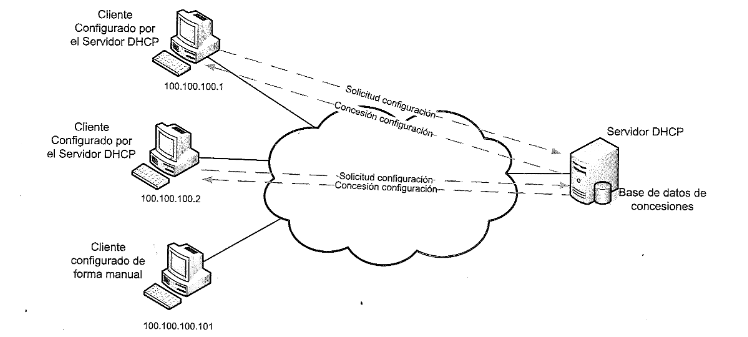
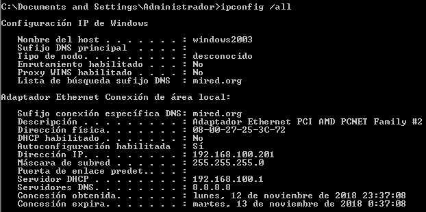
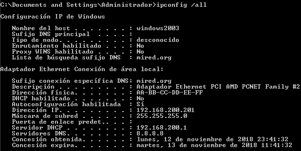
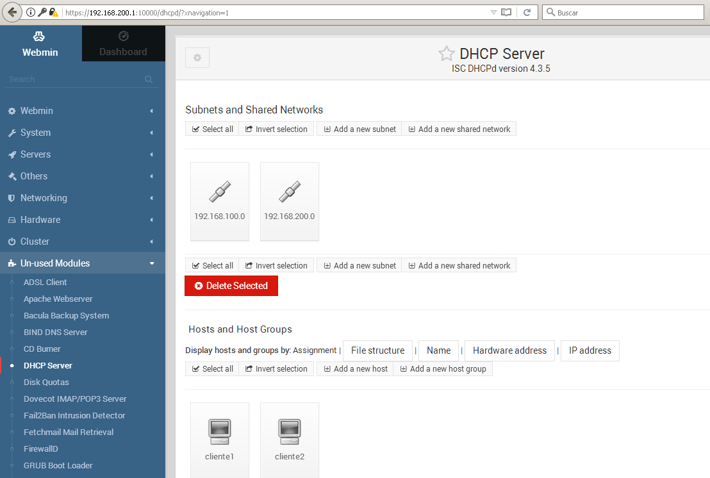
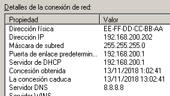
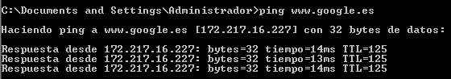
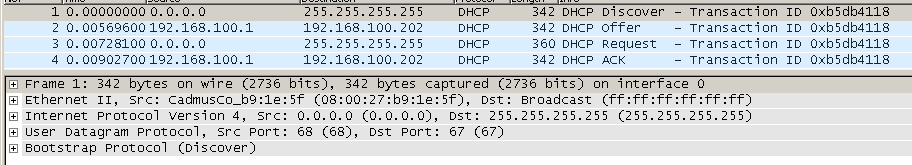

SERVIDOR DHCP
=============

PREGUNTAS DHCP
--------------

 01. **¿En qué consiste DHCP? ¿Qué puertos y protocolo en la capa de transporte utiliza?**

     Es un protocolo de red que permite a los nodos de una red IP obtener sus parámetros de configuración automáticamente de un servidor. El cliente se comunica desde su puerto 68 udp, y el servidor responde desde el 67 udp.

     Los parámetros de red que proporciona el servidor son: dirección IP, máscara de subred, dirección de broadcast, gateway, nombre del host, nombre de la red, y servidores de DNS; pero también puede proporcionar decenas de parámetros menos importantes: servidores NIS, servidores WINS, servidores NTP, etc.

     Los modos de funcionamiento son tres:

     - Estático: las direcciones IPs están reservadas a direcciones MAC.

     - Dinámico: las direcciones IPs son asignadas cuando un cliente las pide, hasta el momento en que el cliente la libera. El servidor intenta dar al cliente la IP que ya asignó al mismo cliente con anterioridad.

     - Automático: las direcciones libres del rango de Ips se asignan aleatoriamente durante un tiempo determinado.

 02. **¿Qué ventajas proporciona? ¿Por qué? ¿Qué desventajas proporciona? ¿Por qué?**

     La ventaja es que permite la configuración centralizada de la red: si hay que realizar cambios, éstos se realizan en el servidor y ya está.

     La desventaja es que si cae el servidor, los nodos de la red no recibirán sus parámetros IP para poder trabajar en red.

     También existen problemas de seguridad: clientes no autorizados (se puede minimizar con DHCP snooping), servidores no autorizados, y ataques de spoofing (agotamiento de IPs).

 03. **Dibuja el esquema de una red local donde hay un servidor de DHCP. ¿Qué debemos configurar en nuestra red para que el tráfico DHCP pase a través de los encaminadores o routers?**

     El servidor DHCP puede estar en cualquier lugar de la red, incluso en el router.

     

     Sin embargo debemos tener en cuenta que el tráfico DHCP utiliza broadcast, y que el tráfico de broadcast no pasa a través de los routers, y se queda aislado en nuestro segmento de red.

     Por ello, si existen varias subredes los routers deben estar configurados para encaminar el tráfico DHCP desde un servidor que esté en una subred diferente (DHCP Relay).

     

 04. **¿Qué es APIPA?**

     Cuando los clientes que deberían obtener parámetros de red mediante DHCP no los consiguen, dichos clientes se autoasignan una dirección el rango 169.254.x.x para poder tener conectividad de red local, aunque sin salida al exterior.

 05. **¿Viene algún software de servidor de DHCP con Windows Server? ¿Desde dónde se instala y desde dónde se administra?**

     Se instala desde *"Server manager -> Agregar roles y características -> ... -> DHCP server"*.

     Se administra desde *"Server manager -> Herramientas -> DHCP"*

 06. **¿Cuál es el software de servidor de DHCP más conocido para Unix/Linux?**

     *ISC DHCP* y *Kea*, pero hay otros más sencillos como *udhcpd*, u otros que integran el servicio de DHCP con el de DNS, como *dnsmasq*.

 07. **Al instalar un servidor de DHCP, ¿Qué parámetros a configurar piensas que serán los más importantes?**

     - Rangos de direcciones IP.

     - Máscara de subred, dirección de broadcast, gateway y servidores de DNS.

     - Nombre de la red.

     - Tiempo de alquiler de los parámetros.

 08. **Al instalar un servidor de DHCP, ¿Qué pruebas piensas que deberás hacer para comprobar el buen funcionamiento?**

     1) Comprobar que cliente y servidor estén en red interna. No poner al servidor en red modo puente, ya que podría convertirse en un servidor DHCP falso en la red real.

     2) Comprobar que el servidor tiene configurada IP estática en la tarjeta de red donde recibirá las peticiones.

     3) Comprobar que las direcciones IP que sirve pertenecen a la misma red lógica que la IP que tiene configurada.

     4) Comprobar que el proceso del servicio DHCP está ejecutándose y que todo es correcto en los logs de arranque del servicio.

     5) Comprobar que el cliente recibe IP, y la concesión queda anotada en la bitácora del servidor.

 09. **¿Cuáles son los pasos en la comunicación entre un cliente y un servidor de DHCP? ¿Cuáles son las IPs de los paquetes?**

     

     1) El cliente envía un paquete DHCPDISCOVER. Las direcciones IP origen y destino de dicho paquete serán 0.0.0.0 y 255.255.255.255 (broadcast) respectivamente.

     2) Cada servidor DHCP responde con un paquete DHCPOFFER ofreciendo los parámetros IP. Las direcciones IP origen y destino de dicho paquete serán la IP del servidor y 255.255.255.255 (broadcast) respectivamente.

     3) El cliente envía un paquete DHCPREQUEST seleccionando una configuración de las ofertas recibidas. Lo envía a toda la red, pero los servidores DHCP saben si fueron escogidos o no por un identificador en el paquete. Las direcciones IP origen y destino de dicho paquete serán 0.0.0.0 y 255.255.255.255 (broadcast) respectivamente.

     4) El servidor escogido confirma mediante un paquete DHCPACK que concede los parámetros al cliente. Las direcciones IP origen y destino de dicho paquete serán la IP del servidor y 255.255.255.255 (broadcast) respectivamente.

 10. **¿Qué pasa si accidentalmente hay dos servidores DHCP en una red? ¿Qué herramienta permite detectarlo?**

     Cuando hay servidores DHCP no autorizados en una red, alguno de ellos puede dar parámetros IP erróneos a los clientes.

     Para detectarlo contamos con *dhcp-probe* (para Unix/Linux), o *dhcp sentry* (para Windows), *Nmap* y *Wireshark*. Hay una lista de herramientas en <http://en.wikipedia.org/wiki/Rogue_DHCP> .

DATOS DE LA PRÁCTICA DHCP
-------------------------

El servidor DHCP, (que en el futuro también será servidor de DNS) deberá tener la IP fija 192.168.100.2, el nombre *Asterix*, y los servidores de DNS 192.168.100.2 y 8.8.8.8. Nuestra red se llama *mired.org*.

Los parámetros que el servidor de DHCP servirá son:

  - Rango de IPs: de la 192.168.100.31 a la 192.168.100.80
  
  - Máscara de red: 255.255.255.0

  - Puerta de enlace: 192.168.100.1

  - Servidores de DNS: 192.168.100.2 y 8.8.8.8

  - Tiempo de alquiler: 1 hora

  - Reservas: la IP 192.168.100.150 ha de quedar reservada a un cliente que se llama *Obelix* cuya MAC es AA:BB:CC:DD:EE:FF.

Este ejercicio da por supuesto que tenemos un router en 192.168.100.1 y un servido de DNS en 192.168.100.2 . De no ser así deben eliminarse dichos datos de la configuración de la tarjeta de red del servidor, y del fichero de configuración del servicio de DHCP.

PRÁCTICA DHCP WINDOWS
---------------------

Instalaremos DHCP para Windows Server. Exploraremos la interfície gráfica de administración del servidor DHCP, configurando los parámetros básicos. Probaremos el servidor (intentando que no interfiera con el servidor de DHCP del instituto).

  01. Manipula la configuración de las tarjetas de red de las máquinas virtuales del servidor y el cliente para que compartan la misma red interna.

  02. El servidor DHCP deberá tener IP fija, ya que no la podrá pedir a nadie.

      *"Panel de control -> conexiones de red -> (escoger conexión) -> propiedades -> TCP/IP -> dar los parámetros TCP/IP estáticos que dice el enunciado"*

  03. Instala y configura el servidor DHCP. Aquí hay unos enlaces con tutoriales paso a paso:

      - [Tutorial Windows servidor DHCP para Windows 2022](https://learn.microsoft.com/en-us/archive/technet-wiki/51170.microsoft-windows-server-2016-dhcp-server-installation-configuration)

      - [Vídeo Windows servidor DHCP para Windows 2025](https://www.youtube.com/watch?v=nc-ratzt1MU)

  04. Prueba el servicio desde un cliente, así como la reserva.

PRÁCTICA DHCP LINUX CON UNA SUBRED
----------------------------------

Instalaremos DHCP para Linux (Debian 13). Exploraremos el fichero de configuración. Probaremos el servidor (intentando que no interfiera con el servidor de DHCP del instituto).

  - <https://reintech.io/blog/installing-configuring-dhcp-server-debian-12>

  - <https://www.howtoforge.com/tutorial/install-and-configure-isc-dhcp-server-in-debian-9/>

  - <https://wiki.debian.org/DHCP_Server>

Aviso, este tutorial está desactualizado pues ISC pide cambiar al nuevo servidor [Kea](https://kb.isc.org/docs/kea-administrator-reference-manual) (paquete `kea-dhcp4-server`)

 01. Manipula la configuración de las tarjetas de red de las máquinas virtuales del servidor y el cliente para que compartan la misma red interna.

 02. El servidor DHCP deberá tener IP fija, ya que no la podrá pedir a nadie. (¡Antes de escribir los datos comprueba cual es el nombre de la tarjeta de red, ya que puede no ser *enp0s3*!).

         # ip addr
         
         # nano /etc/network/interfaces

             auto enp0s3
             iface enp0s3 inet static
                 address   192.168.100.2
                 netmask   255.255.255.0
                 gateway   192.168.100.1

         # nano /etc/resolv.conf

             domain       mired.org
             nameserver   192.168.100.2
             nameserver   8.8.8.8

         # nano /etc/hostname

             asterix

     y a continuación reinicia la red y prueba que ésta funciona:

         # systemctl restart networking

     Comprobación: podemos hacer correctamente ping al router o al exterior

         $ ping www.google.es

 03. Instala y configura el servidor DHCP:

         # apt update

         # apt install isc-dhcp-server

         # man dhcpd.conf

         # nano /etc/dhcp/dhcpd.conf

             authoritative;

             # ámbito de mi red
             subnet 192.168.100.0 netmask 255.255.255.0 {

               # Pool de direcciones
               range 192.168.100.31 192.168.100.80;
               default-lease-time 3600;
               max-lease-time 3600;

               # reserva que hago a uno de los clientes (¡tu MAC será otra!)
               host Obelix {
                 hardware ethernet AA:BB:CC:DD:EE:FF;
                 fixed-address 192.168.100.150;
                 option host-name "Obelix";
               }

               # Opciones del ámbito
               option domain-name-servers 192.168.100.2 , 8.8.8.8;
               option domain-name "mired.org";
               option routers 192.168.100.1;
             }

     Además, debemos asociar el servicio de DHCP a una tarjeta de red específica, editando la opción *INTERFACES* del fichero `/etc/default/isc-dhcp-server` :

         # nano /etc/default/isc-dhcp-server

             INTERFACESv4="enp0s3"
             INTERFACESv6=""
       
     A continuación reinicia el servicio:

         # systemctl restart isc-dhcp-server

     Comprobación: el servicio está escuchando por el puerto correspondiente

         # ss -plun

     Si el servicio parece que no funciona, estudia en los logs porqué no ha arrancado:

         # journalctl -e -u isc-dhcp-server

 04. Prueba el servicio desde un cliente, así como la reserva. Para ver las direcciones IP concedidas por el servidor DHCP, ejecuta el comando:

         # cat /var/lib/dhcp/dhcpd.leases

     Si quieres obtener una IP desde el terminal de un cliente Debian o Ubuntu, el comando es:

         $ sudo dhclient -v [tarjeta_de_red]

PRÁCTICA DHCP LINUX CON VARIAS SUBREDES
---------------------------------------

Recomiendo consultar la siguiente documentación antes:

  - <https://access.redhat.com/documentation/en-us/red_hat_enterprise_linux/7/html/networking_guide/ch-dhcp_servers>

  - <https://docs.redhat.com/en/documentation/red_hat_enterprise_linux/10/html/managing_networking_infrastructure_services/providing-dhcp-services>

Recuerdo: _tu-ip_ simboliza un número que te reparte el profesor, para que cada alumno/a tenga parámetros diferentes en la práctica. En nuestro caso será el último número de la IP de tu equipo en clase. Por ejemplo, si tu IP es 192.168.217.**118** , entonces tus subredes en la máquina virtual del ejercicio serán 192.168.**118**.0/24 y 192.168.**218**.0/24.

 01. a) Instala un servidor DHCP:

         # apt update
 
         # apt install isc-dhcp-server
       
     b) El servidor DHCP tendrá tres tarjetas de red: una en modo NAT y dos en modo red interna, asignadas a redes internas diferentes, **red1** y **red2**, respectivamente. El nombre de las tarjetas de red seguramente será **enp0s3**, **enp0s8** y **enp0s9**, respectivamente.

     La tarjeta de red del servidor en red1 tiene IP estática 192.168._tu-ip_.1
     
     La tarjeta de red del servidor en red2 tiene IP estática 192.168._tu-ip_+100.1
     
         # ip addr

         # nano /etc/network/interfaces

             auto enp0s3
             iface enp0s3 inet dhcp

             auto enp0s8
             iface enp0s8 inet static
                 address   192.168._tu-ip_.1
                 netmask   255.255.255.0

             auto enp0s9
               iface enp0s9 inet static
               address   192.168._tu-ip_+100.1
               netmask   255.255.255.0

     y a continuación reinicia la red:

         # systemctl restart networking

     Comprobación: podemos hacer correctamente ping al exterior o a otro equipo en red interna

         $ ping www.google.es
       
     c) El servidor DHCP sólo estará asignado a las dos tarjetas en red interna.

         # nano /etc/default/isc-dhcp-server

             INTERFACESv4="enp0s8 enp0s9"
             INTERFACESv6=""
       
     d) En *red1* el servidor repartirá un pool de 10 direcciones, de 192.168._tu-ip_.201 a 192.168._tu-ip_.210

     En *red2* el servidor repartirá las reservas: 192.168._tu-ip_+100.201 a la MAC aa:bb:cc:dd:ee:ff y 192.168._tu-ip_+100.202 a la MAC ee:ff:dd:cc:bb:aa
     
     A las reservas, además, les proporcionará el nombre de host, *server* y *dns2*, respectivamente.
     
     A los clientes les proporcionará como mínimo la IP, la máscara (255.255.255.0), el servidor DNS (8.8.8.8), y el dominio (*mired.org*).
     
         # nano /etc/dhcp/dhcpd.conf

            # Opciones del ámbito "red1" (pool)
            subnet 192.168._tu-ip_.0 netmask 255.255.255.0 {
              range 192.168._tu-ip_.201 192.168._tu-ip_.210;
              default-lease-time 3600;
              max-lease-time 3600;
            }

            # Opciones del ámbito "red2" (las reservas van fuera)
            subnet 192.168._tu-ip_+100.0 netmask 255.255.255.0 {
            }

            # Opciones de todos los ámbitos
            option domain-name-servers 8.8.8.8;
            option domain-name "mired.org";

            # Reserva "server" ámbito 2
            host server {
              hardware ethernet AA:BB:CC:DD:EE:FF;
              fixed-address 192.168._tu-ip_+100.201;
              option host-name "server";
            }

            # Reserva "dns2" ámbito 2
            host dns2 {
              hardware ethernet EE:FF:DD:CC:BB:AA;
              fixed-address 192.168._tu-ip_+100.202;
              option host-name "dns2";
            }

         # systemctl restart isc-dhcp-server

 02. Pon un par de máquinas virtuales de prueba en *red1*, y comprueba que reciban parámetros de red.
       
     

 03. Pon un par de máquinas virtuals de prueba en *red2*, y comprueba que reciban la dirección reservada a su MAC. (-Modifica antes su MAC en la herramienta de virtualización para que se ajuste a la de la reserva-)

     

 04. ¿Por qué el cliente Windows con reserva no cambia su hostname?

     Por que Windows no soporta asignación de hostname vía DHCP.

     ¿Por qué el cliente Linux con reserva no cambia su hostname?
     
     Por que hay que realizar cambios en Linux para que acepte asignación de hostname vía DHCP.

 05. Instala en el servidor el módulo de Webmin para administrar DHCP.

     <https://IP_servidor:10000/> -> Un-used Modules -> DHCP Server

     <https://IP_servidor:10000/> -> Refresh Modules

     <https://IP_servidor:10000/> -> Servers -> DHCP Server
       
     

 06. Consigue que el servidor actúe como enrutador, encaminando los paquetes de *red1* y *red2* hacia a la tarjeta en modo NAT, permitiendo a los equipos de dichas redes accedan a Internet.

     a) Escribir un script de enrutamiento en el servidor

     Este programa con comandos de iptables comunica *red1* y *red2* con internet, pero también *red1* y *red2* entre ellas. El script supone que la tarjeta *enp0s3* está conectada a Internet, la tarjeta *enp0s8* está conectada a *red1*, y la tarjeta *enp0s9* está conectada a *red2*.

         # nano /root/enrutamiento.sh

             #!/bin/bash
             echo "1" > /proc/sys/net/ipv4/ip_forward
             iptables -A FORWARD -j ACCEPT

             iptables -t nat -A POSTROUTING -s 192.168._tu-ip_.0/24 -d 192.168._tu-ip_+100.0/24 -o enp0s9 -j MASQUERADE
             iptables -t nat -A POSTROUTING -s 192.168._tu-ip_.0/24                             -o enp0s3 -j MASQUERADE

             iptables -t nat -A POSTROUTING -s 192.168._tu-ip_+100.0/24 -d 192.168._tu-ip_.0/24 -o enp0s8 -j MASQUERADE
             iptables -t nat -A POSTROUTING -s 192.168._tu-ip_+100.0/24                         -o enp0s3 -j MASQUERADE

         # chmod +x /root/enrutamiento.sh

     Sin embargo, pensaba que también podría comunicar las redes entre ellas y con el exterior añadiendo las rutas a mano, sin iptables. No lo he conseguido. Comencé con algo parecido a esto:

             #!/bin/bash
             sysctl net.ipv4.conf.all.forwarding=1
             ip route add 192.168._tu-ip_.0/24     dev enp0s8
             ip route add 192.168._tu-ip_+100.0/24 dev enp0s9
             ip route add default dev enp0s3
       
     b) El servidor DHCP también deberá dar puerta de salida (gateway) a los clientes. ¿Cuál será?

     El gateway será la IP de la tarjeta del servidor, que hace de router, conectada a esa red. Las IPs que hemos dado a las tarjetas del servidor eran: 192.168._tu-ip_.1 y 192.168._tu-ip_+100.1

         # nano /etc/dhcp/dhcpd.conf

             subnet 192.168._tu-ip_.0 netmask 255.255.255.0 {
               ...
               option routers 192.168._tu-ip_.1;
             }

             subnet 192.168._tu-ip_+100.0 netmask 255.255.255.0 {
               ...
               option routers 192.168._tu-ip_+100.1;
             }

         # systemctl restart networking

     

     

     ¿Como consigues que el script de enrutamiento se ejecute automáticamente en el inicio de la máquina servidor?

         # nano /etc/systemd/system/enrutamiento.service

             [Unit]
             Description=Enrutamiento systemd service

             [Service]
             Type=simple
             ExecStart=/bin/bash /root/enrutamiento.sh

             [Install]
             WantedBy=multi-user.target

         # systemctl start enrutamiento

         # systemctl status enrutamiento

         # systemctl enable enrutamiento

 07. Con un cliente de red que ya haya obtenido parámetros, inicia el programa Wireshark y captura el tráfico de red de un segundo cliente tratando de obtener los parámetros DHCP.

     

 08. Pon este servidor DHCP en red interna con el otro servidor DHCP del ejercicio anterior.

     Añade un cliente a la red interna y detecta todos los servidores de DHCP con el programa Nmap.

         # nmap --script broadcast-dhcp-discover

         # nmap --script dhcp-discover -sU -p 67 192.168._tu-ip_.0/24

         # nmap --script dhcp-discover -sU -p 67 192.168._tu-ip_+100.0/24

REFERENCIAS DHCP
----------------

  - <https://en.wikipedia.org/wiki/Dynamic_Host_Configuration_Protocol>

  - <https://en.wikipedia.org/wiki/DHCPv6>
  
  - <https://en.wikipedia.org/wiki/Comparison_of_DHCP_server_software>

  - <https://cibersafety.com/dhcp-snooping-seguridad-dhcp-2/>
