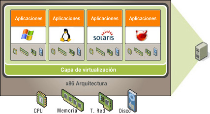
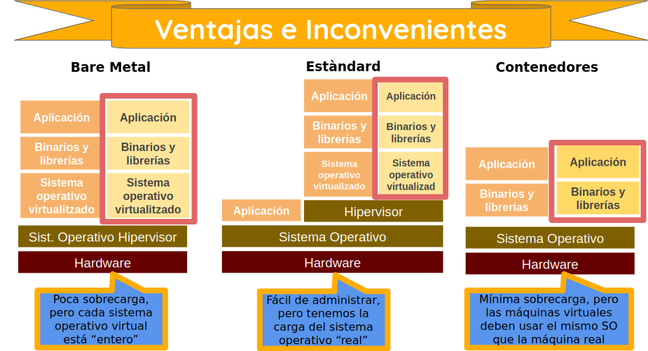

Repaso de virtualización con VirtualBox
=======================================

Respuestas a las preguntas
--------------------------

  01. [Tipos de virtualización](#tipos-de-virtualizaci-n)
  02. [Línea de comandos (VboxManage)](#l-nea-de-comandos-vboxmanage)
  03. [Discos duros de expansión dinámica](#discos-duros-de-expansi-n-din-mica)
  04. [Creación de una máquina virtual a partir de un disco virtual ya existente](#creaci-n-de-una-m-quina-virtual-a-partir-de-un-disco-virtual-ya-existente)
  05. [Clonación de discos duros virtuales](#clonaci-n-de-discos-duros-virtuales)
  06. [Importación y exportación en formato estándar OVF](#importaci-n-y-exportaci-n-en-formato-est-ndar-ovf)
  07. [Snapshots](#snapshots)
  08. [Montar un CD o un USB en una máquina virtual en ejecución](#montar-un-cd-o-un-usb-en-una-m-quina-virtual-en-ejecuci-n)
  09. [VirtualBox GuestAdditions y Carpetas compartidas](#virtualbox-guestadditions-y-carpetas-compartidas)
  10. [Modos de trabajo en red](#modos-de-trabajo-en-red)

Tipos de virtualización
-----------------------

  * Emulación del hardware a nivel de aplicación: un simulador ejecuta instrucciones para una CPU concreta en un sistema real con una CPU y juego de instrucciones distinta a la emulada. La ventaja es que permite ejecutar en un ordenador software destinado a una plataforma diferente, y la desventaja es que es muy lento transformar el código máquina de una CPU en código máquina de otra CPU. Ejemplos de este tipo de virtualización son Bochs, Qemu y Mame.

  * Virtualización sin soporte hardware: un hipervisor se encarga de analizar dinámicamente el código a ejecutar del sistema virtualizado, reemplazando las instrucciones críticas que acceden al hardware virtual por otras que consiguen el efecto deseado, mientras que las instrucciones no críticas se ejecutan directamente en la cpu de la máquina real. La ventaja es que permite ejecutar sistemas operativos sin modificar. Ejemplos de este tipo de virtualización son VirtualBox y VMWare.

  * Paravirtualización: es similar a la virtualización sin soporte hardware, pero se modifica el sistema operativo invitado (-esto no siempre será posible-) para que sea el mismo el que avise cuando quiera ejecutar instrucciones críticas, así que se gana en rendimiento al no tener que vigilarlo. Ejemplo de este tipo de virtualización es Xen.

  * Virtualización con soporte hardware: es similar a la virtualización sin soporte hardware, pero aprovecha las tecnologías incorporadas en las nuevas generaciones de CPUs (Intel-VT y AMD-V) para ejecutar el código del sistema operativo invitado sin modificarlo. Será el sistema operativo invitado el que avise cuando quiera ejecutar instrucciones críticas, así que se gana en rendimiento al no tener que vigilarlo. Ejemplo de este tipo de virtualización es KVM.

  * Virtualitzación a nivel de sistema operativo: solo se ejecuta un sistema operativo, el de la máquina real, que crea entornos de ejecución para que las aplicaciones crean que se encuentran en un sistema independiente cuando en realidad comparten recursos con otras máquinas virtuales. La ventaja es que permite gran rendimiento al no haber de soportar hardware virtual ni de supervisar el invitado, y la desventaja es que al haber un sólo núcleo de sistema operativo, si éste cae caerían también todas las máquinas virtuales. Ejemplo de este tipo de virtualización son los contenedores Docker.

En los siguientes puntos profundizaremos en el manejo de VirtualBox. VirtualBox es un software de virtualización sencillo, gratuito y multiplataforma. Sin embargo, no es muy completo y además puede dar problemas en el sistema operativo de la máquina real.

Si queremos trabajar con un software de virtualización mucho más “profesional”, con muy buen redimiento, con opciones avanzadas, y gratuito, para Linux recomiendo KVM (paquetes qemu-kvm y virt-manager).

Si además queremos montar para producción toda una plataforma de virtualización, recomiendo la distribución Linux gratuita [Proxmox](https://www.proxmox.com/en/products/proxmox-virtual-environment/overview).

Línea de comandos (VboxManage)
------------------------------

Los sistemas de virtualización permiten mayor potencia y flexibilidad si son utilizados desde línea de comandos que desde su interfaz gráfica. Por ejemplo, si en VirtualBox queremos que una máquina virtual tenga más de cuatro tarjetas de red, sólo podremos especificarlo desde línea de comandos.

En VirtualBox, el comando que permite hacer todo tipo de operaciones con la máquina virtual (muchas más operaciones que con la interfaz gráfica) es `VBoxManage`, del que podéis encontrar una extensa referencia en el manual de VirtualBox: <https://www.virtualbox.org/manual/topics/vboxmanage.html> .

Discos duros de expansión dinámica
----------------------------------

En el proceso de creación de una máquina virtual os preguntará si el disco duro virtual lo queremos de expansión dinámica o de tamaño fijo. El de tamaño fijo siempre ocupará todo el tamaño que le hemos dado, aunque los programas que instalemos dentro ocupen mucho menos. El de expansión dinámica da menor rendimiento, pero no ocupará el tamaño que le hemos dicho, sino tan sólo el tamaño de los programas instalados dentro.

Por cierto, el tamaño de los discos duros virtuales no se puede ampliar des de la interfaz gráfica una vez llegados al límite que especificamos al crearlos, pero siempre se pueden añadir más discos duros virtuales a la máquina virtual. Pero desde la línea de comandos sí se pueden ampliar con:

    VBoxManage modifyhd <fichero_disco> --resize <nuevo_tamaño_megabytes>

Por otro lado, con el tiempo veremos que nuestros disco duros de expansión dinámica crecen y crecen aunque borremos datos. Para "adelgazar" un disco duro de expansión dinámica debemos sobreescribir su espacio libre con ceros (por ejemplo con [sdelete -z](http://download.sysinternals.com/files/SDelete.zip) en una máquina virtual Windows o con [zerofree](https://frippery.org/uml/) en una máquina virtual Linux), y a continuación apagar la máquina virtual y desde la línea de comandos ejecutar:

    VBoxManage modifyhd <fichero_disco> --compact

Por último quiero hacer un inciso para comentar que desde el menú *"Archivos -> Herramientas -> Soporte"* se nos abre la ventana del administrador de medios virtuales que también nos permite manejar tanto los discos duros virtuales como las diferentes imágenes de DVD que hemos incorporado a nuestra biblioteca de VirtualBox.

Creación de una máquina virtual a partir de un disco virtual ya existente
-------------------------------------------------------------------------

Debéis crear los discos duros de las máquinas virtuales en particiones donde sepáis que no os los van a borrar. Por cierto, dichas particiones mejor que no sean de tipo FAT32 ya que no admiten tamaños de fichero superior a 4Gb.

Si os encontráis con que habéis perdido una máquina virtual, es cuestión de segundos crear una nueva si un compañero o profesor os dejan el disco duro de una que ya existía, con todo el sistema instalado. Tan sólo tenéis que copiar ese disco duro virtual a vuestro sistema, agregarlo al administrador de medios virtuales, y comenzar a crear una nueva máquina. Cuando en el proceso de creación os pregunte por el disco duro, escoger el que os han dejado. Ya está.

Aviso: una vez seguido el procedimiento, seguramente la máquina virtual tenga una tarjeta de red con una dirección MAC diferente a la tarjeta anterior. Esto hará que en Linux cambien el nombre de la tarjeta, por ejemplo, de *eth0* a *eth1*, lo cual os puede obligar a reconfigurar los parámetros de red si estaban en configuración manual, en lugar de DHCP, y otros cambios que tengan que ver con el nombre de la tarjeta (reglas del cortafuegos, etc). Para volver a tener el nombre original en la tarjeta de red, basta con borrar un fichero y reiniciar:

    sudo rm /etc/udev/rules.d/70-persistent-net.rules

Clonación de discos duros virtuales
-----------------------------------

Si cuando ya tenemos creada una máquina virtual e instalados los programas queremos otra igual, nuestra primera idea seguramente será crear una copia del fichero asignado al disco duro virtual. Una vez tengamos la copia la podemos añadir al administrador de medios virtuales, y entonces asignarlo a una nueva máquina. ¡Craso error!

Los discos duros virtuales llevan asignado un identificador único. Si utilizamos el método anterior, la nueva máquina virtual no funcionará bien. Para que todo vaya bien debemos copiar el disco duro con la herramienta de clonación que nos proporciona VirtualBox:

    VBoxManage clonehd <fichero_disco_a_clonar> <fichero_nuevos_disco>

Importación y exportación en formato estándar OVF
-------------------------------------------------

Si queréis mover una máquina virtual de un lado a otro, o incluso de una plataforma de virtualización a otra diferente (por ejemplo de VirtualBox a VMWare o viceversa), debéis exportarla en el formato estándar OVF.

Snapshots
---------

VirtualBox permite realizar un "backup" o "fotografía" o "instantánea" de un disco duro virtual, que nos será útil cuando ya tenemos el sistema operativo y programas perfectamente instalados en la máquina virtual. Cuando realizamos un snapshot de un disco duro, el estado de ese disco duro se conserva y los cambios que realicemos desde entonces se guardan a parte. Nosotros siempre veremos el disco duro actualizado, con los cambios, pero en el momento que queramos podremos volver la anterior fotografía del disco duro, perdiendo los últimos cambios realizados desde entonces. También podemos hacer lo contrario: deshacer la fotografía, incorporando permanentemente los cambios hechos desde entonces.

Montar un CD o un USB en una máquina virtual en ejecución
---------------------------------------------------------

Cuando una máquina virtual se está ejecutando, podéis cambiar el contenido de la unidad de CD virtual haciendo clic sobre el icono de CD que se encuentra en la parte inferior derecha de la ventana de la máquina virtual.

Cuando una máquina virtual se está ejecutando, podéis acceder al contenido de una memoria USB conectada a la máquina real haciendo clic sobre el icono de USB que se encuentra en la parte inferior derecha de la ventana de la máquina virtual.

Pero cuando he tenido una máquina virtual Windows dentro de una máquina real Windows, me ha pasado lo siguiente la primera vez que intenté acceder al USB desde la máquina virtual: puede ser que la máquina real os pida instalar los controladores de USB de VirtualBox. Hacedlo siguiendo los pasos que os dan, pero después puede ser que debáis reiniciar la máquina virtual para que os reconozca el USB o de lo contrario la máquina virtual se colgará.

VirtualBox GuestAdditions y Carpetas compartidas
------------------------------------------------

¿Qué son los GuestAdditions? Son unos programas que se instalan en la máquina virtual, y que una vez instalados consiguen que la máquina virtual colabore con la máquina real para brindarnos una mayor facilidad de uso. Después de instalar los GuestAdditions obtendremos, entre otras cosas:

  * Que puedo pasar de la máquina virtual a la máquina real, y viceversa, con solo desplazar el ratón dentro o fuera de la ventana de la máquina virtual.

  * Que la máquina virtual comparte el portapapeles con la real (por ejemplo, podré realizar una captura de pantalla en la máquina virtual y encontrar dicha imagen en el portapapeles de la máquina real, listo para ser enganchado en un editor de textos).

  * Que al redimensionar la ventana de la máquina virtual, el tamaño de la imagen se adapta al tamaño de la ventana.

  * Que la máquina virtual y la real pueden compartir una carpeta, y que lo que en dicha carpeta deje una máquina será accesible por la otra. La carpeta compartida será una carpeta de la máquina real, y la máquina virtual la verá como una carpeta compartida en la red Windows/Samba ( `\\vboxsrv\nombre_carpeta` ).

Para instalar los GuestAdditions, cuando se ejecuta una máquina virtual, en su ventana debemos escoger el menú *"Dispositivos -> Instalar aplicaciones Guest Additions"*. Esto lo que hará será introducir un CD virtual con los Guest Additions en la máquina virtual. Dicho CD es de autoarranque, por lo que los Guest Additions deben instalarse prácticamente solos. Si no es así, desde el sistema operativo de la máquina virtual debemos acceder a su unidad de CD y ejecutar a mano los programas que contiene.

Para la plataforma de virtualización VMWare existe una herramienta equivalente llamada VMWare Tools.

Modos de trabajo en red
-----------------------

  * NAT: la máquina virtual obtiene una dirección IP de un servidor DHCP implementado en VirtualBox. Dicha IP (suele ser 10.0.x.15) no está en el rango de la red externa, pero VirtualBox hace de router. Por lo tanto desde nuestra máquina virtual se puede acceder a la red real externa, pero desde la red real externa no se puede acceder a la máquina virtual (a menos que configuremos el reenvío de puertos en las propiedades avanzadas de dicha interfaz de red). Las máquinas virtuales con NAT tampoco pueden verse entre ellas ya que VirtualBox las suele colocar en subredes diferentes, a menos que hayamos seleccionado el modo “red NAT”. (Para cambiar el comportamiento de NAT, leer en el manual de VirtualBox el capítulo [Fine-tuning the Oracle VirtualBox NAT engine](https://www.virtualbox.org/manual/topics/networkingdetails.html#changenat) ).

  * Bridge o puente: la máquina virtual obtiene una dirección IP real de un servidor DHCP de la red externa real. Por lo tanto desde nuestra máquina virtual se puede acceder a la red real externa, y desde la red real externa se puede acceder a la máquina virtual. Las máquinas virtuales con bridge pueden verse entre ellas ya que están en la misma subred. (De hecho, utilizan la tarjeta de red de la máquina real).

  * Red interna: VirtualBox simula una red interna conectando varias máquinas virtuales con el mismo identificador de red interna, como si fuera un switch virtual. Las máquinas virtuales con red interna similar pueden verse entre ellas ya que están en la misma subred.
  
Una máquina virtual puede tener varias tarjetas de red, cada una trabajando en modo diferente. Por ejemplo, puedo tener varias máquinas virtuales unidas en red interna, y una de ellas con una tarjeta de red adicional funcionando en modo NAT, haciendo de router hacia la red exterior.
  
En versiones modernas de Virtualbox aparecen dos modos más de trabajo en red, aunque no los utilizaremos en nuestro curso:

  * Anfitrión: es parecido al modo red interna, pero las máquinas virtuales también pueden comunicarse con la máquina real. Puede ser útil si des de la máquina anfitrión quiero comunicarme con servicios instalados en la máquina virtual. Se puede configurar DHCP para esta red en el menú *"Archivo -> Herramientas -> Red"*.

  * Controlador genérico con túnel UDP: permite interconectar máquinas virtuales que están en diferentes máquinas reales, encapsulando las tramas ethernet dentro de datagramas UDP. (Leer en el manual de VirtualBox el capítulo [UDP Tunnel networking](https://www.virtualbox.org/manual/topics/networkingdetails.html#changenat) ).

Aviso: cuando en el hardware de red seleccionamos una tarjeta paravirtualizada virtio-net, no se trata de una tarjeta virtual sino de un software especial que mejorará el rendimiento en el tráfico de red, siempre que en el sistema operativo de la máquina virtual instalemos los controladores de dicha tarjeta. Linux viene con dichos controladores, y para Windows se pueden descargar de la [página web](https://fedorapeople.org/groups/virt/virtio-win/direct-downloads/stable-virtio/) del proyecto KVM.
