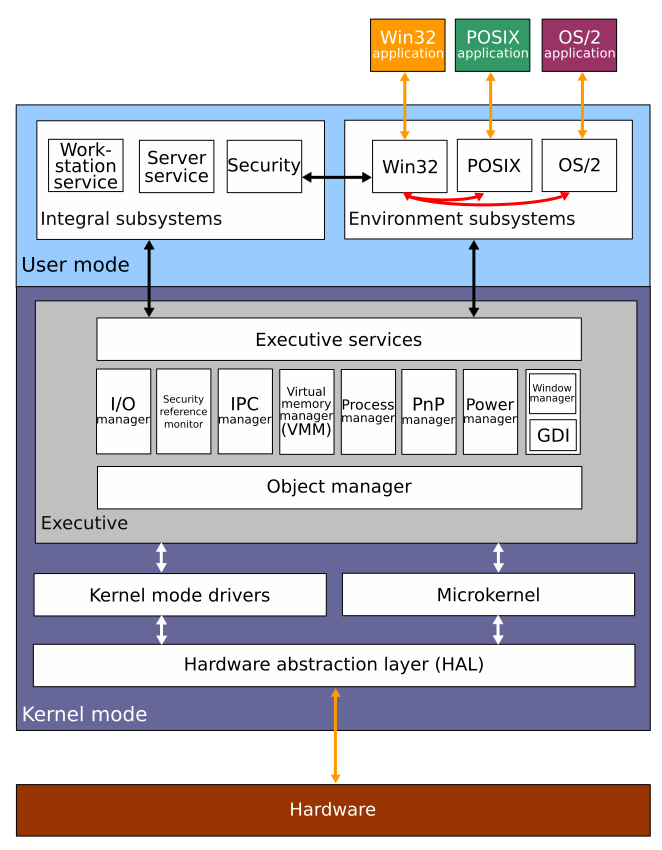

Windows Server
==============

 | Windows usuario | Versión equiv servidor |
 |:--------------- |:---------------------- |
 | Windows 95      | Windows NT Server 4.0  |
 | Windows 98      | Windows Server 2000    |
 | Windows XP      | Windows Server 2003    |
 | Windows Vista   | Windows Server 2008    |
 | Windows 7       | Windows Server 2008r2  |
 | Windows 8       | Windows Server 2012    |
 | Windows 8.1     | Windows Server 2012r2  |
 | Windows 10 1607 | Windows Server 2016    |
 | Windows 10 1809 | Windows Server 2019    |
 | Windows 10 21H2 | Windows Server 2022    |
 | Windows 11 24H2 | Windows Server 2025    |

PREGUNTAS
---------

 01. ¿Qué diferencias básicas hay entre una versión de Windows "no server" y una versión "server"?
     
     **Internamente la arquitectura es similar (arquitectura NT), ya que se unifico con Windows XP.**

     

     **Sin embargo Windows Server:**

     - **Dispone de muchas más herramientas de administración,**
     - **Dispone de más servicios de Windows: DHCP, DNS, Active Directory, IIS, Hyper-V, etc.**
     - **Detecta más RAM, soporte multiprocesador, sólo 64 bits**
     - **Tiene un núcleo optimizado para aplicaciones en segundo plano y menos optimizado para multimedia**
     - **Gestiona el almacenamiento de maneras mucho más avanzadas: storage pools, discos virtuales, RAIDs, ...**
     - **Simplifaica el escritorio, eliminando los efectos.**

 02. Dibuja la tabla de requisitos hardware de las sucesivas versiones de Windows Server.

| Windows Server | Novedades | Requisitos | Ediciones |
| :------------: | :-------- | :--------- | :-------- |
| Windows NT 4.0 | Núcleo NT 4.0. Hasta 4GB de memòria. Mayor estabilidat: hardware abstraction layer (HAL). Mayor escalabilidad. Políticas del sistema. IIS 2.0 | CPU 33 MHz, RAM 12 MB, HD 110 MB | Workstation, Server, Server Enterprise Edition, Terminal Server, Embedded |
| Windows 2000   | Núcleo NT 5.0. Active Directory. Servidor de DNS y de DHCP. Políticas de grupo. Autentificación Kerberos. Plug & Play. NTFS 3.0. IIS 5.0. RAID 1 y RAID 5. Terminal Services y Remote Desktop Protocol (RDP) | CPU 133 MHz, RAM 128 MB, HD 650 MB | Professional, Server, Advanced Server, Datacenter Server, Powered (Embedded) |
| Windows 2003   | Núcleo NT 5.2. Data Execution Prevention. IIS 6.0. Mejoras en Active Directory. Mejoras en Políticas de grupo | CPU 1 GHz, RAM 256 MB, HD 4Gb | Standard, Enterprise, Datacenter, Web, Storage, Small Business Server, Compute Cluster |
| Windows 2008   | Núcleo NT 6.0. 64 bits. Mejoras en NTFS. Instalación server core. Cónsola de administración de servidores. Mäs herramientas de administración de clúster. Soporte arranque EFI. IIS 7.0, sin POP3 ni SMTP | CPU 1.4 GHz, RAM 2 GB, HD 32 GB | Web, Standard, Enterprise, Small Business Server, Datacenter, HPC, HyperV Core, Foundation, Storage |
| Windows 2008r2 | Núcleo NT 6.1. Sólo 64 bits. IIS 7.5. Más herramientas de administración de virtualización. | CPU 1.4 GHz, RAM 2 GB, HD 32 GB | Standard, Enterprise, Datacenter, Web |
| Windows 2012   | Núcleo NT 6.2. Soporte para USB 3.0. Nuevo Task manager. Nuevo Hyper-V. IIS 8.0. ReFS para servidores de ficheros | CPU 1.4 GHz, RAM 2 GB, HD 32 GB | Foundation, Essentials, Standard, Datacenter |
| Windows 2012r2 | Núcleo NT 6.3. PowerShell v4. IIS 8.5. Trae de serie Windows Server Update Services | CPU 1.4 GHz, RAM 2 GB, HD 32 GB | Foundation, Essentials, Standard, Datacenter |
| Windows 2016   | Núcleo NT 10 1607. IIS 10. PowerShell v5.1. Nano Server. Protección de máquinas virtuales. Windows Defender. Continua orientándose a Datacenter, Cloud y Clúster | CPU 1.4 GHz, RAM 2 GB, HD 32 GB | Essentials, Standard, Datacenter |
| Windows 2019   | Núcleo NT 10 1809. Contenedores Linux. IIS 10. PowerShell v5.1. Windows Admin Center. | CPU 1.4 GHz, RAM 2 GB, HD 32 GB | Essentials, Standard, Datacenter |
| Windows 2022   | Núcleo NT 10 21H2. IIS 10. PowerShell v5.1. TPM 2.0. Se integra mejor con Azure | CPU 1.4 GHz, RAM 2 GB, HD 32 GB | Essentials, Standard, Datacenter |
| Windows 2025   | Núcleo NT 10 24H2. IIS 10. PowerShell v5.1. | CPU x86-64-v2, RAM 2 GB, HD 32 GB | Essentials, Standard, Datacenter |

 03. ¿Cuáles son características más importantes que ha incorporado cada nueva versión de Windows Server?

     **Ver tabla anterior**

 04. Para una versión de Windows Server, que diferencias hay entre sus "ediciones"? Por ejemplo, para Windows Server 2012, ¿Qué diferencias hay entre las ediciones Foundation, Essentials, Standard y Datacenter?

     **Diferencias en precio, servicios disponibles, número de instancias a ejecutar, número de CPUs, número de usuarios. En el ejemplo:**

     - **2012 Datacenter: para servidores potentes, de hasta 64 procesadores y tolerancia a fallos.**

     - **2012 Standard: lo mismo que la edición Datacenter, pero la licencia permite muchas menos máquinas virtuales (sólo dos).**

     - **2012 Essentials: casi lo mismo que la edición Standard, pero sin instalación Server Core, sin Hyper-V, sin servicio de Federación de Active Directory, y restringido a 25 usuarios.**

     - **2012 Foundation: es una versión reducida del SO para pequeños negocios que necesitan compartir ficheros e impresoras. Limitada a 15 usuarios y sin derechos de virtualización.**

     **Hay que aclarar que las restricciones no son físicas, sino de licencias. Por ejemplo, en la versión estándar puedo instalar más de dos máquinas virtuales, aunque la licencia sólo permita dos, pero legalmente deberé adquirir licencias adicionales para ello.**

 05. ¿Qué diferencia hay entre una instalación normal y una instalación "server core" en las últimas versiones de Windows Server?

     **La instalación normal instala todo el sistema gràfico y escritorio, mientras que server core tan sólo tiene línea de comandos con PowerShell, lo que la hace muchísimo más ligera y menos expuesta a fallos, además de ocupar menos disco duro y necesitar menos actualizaciones de seguridad.**

     **En Windows 2008, una vez instalado no se podía cambiar de una opción a la otra, pero desde Windows 2012, aunque hayamos escogido un tipo de instalación después se puede cambiar sin necesidad de reinstalar el sistema.**

     **Existe un tercer tipo de instalación gráfica mínima, que no tiene escritorio ni menú ni aplicaciones, pero si permite abrir el panel de administración de servidores, el MMC, y una ventana con PowerShell.**

     <https://msdn.microsoft.com/es-es/library/hh831786%28v=ws.11%29.aspx>

 06. ¿Cuánto cuesta un Windows Server?

     **El coste monetario depende de la edición y las licencias.**

 07. ¿Cómo funciona el sistema de licencias?

     **En el caso de un Windows Server el tema de las licencias es complejo: se compran licencias por número de usuarios, por número de CPUs, por clientes conectados, por número de instalaciones o máquinas virtuales, etc.**

     **Para el caso anterior (Windows Server 2012) puedes consultar la complejidad del sistema de licencias en este enlace:**

     <http://download.microsoft.com/download/0/4/E/04E7E3B8-EEA6-421B-91EA-546AEBD325AC/Windows_Server_2012_R2_Licensing_Datasheet_es-es.pdf>

 08. ¿Qué es PowerShell?

     **Es la línea de comandos avanzada de Windows, disponible des de Windows 7.**

     - <https://learn.microsoft.com/es-es/powershell/scripting/learn/ps101/01-getting-started>

     - <https://en.wikipedia.org/wiki/PowerShell>

     - <http://elpaladintecnologico.blogspot.com.es/2009/02/que-es-powershell-ejemplos-basicos-para.html>

 09. ¿Desde dónde se instalan servicios y componentes adicionales de Windows Server?

     **Existen dos herramientas donde es posible diche instalación: “agregar características de Windows” y “Panel de Administración de Servidores”**

 10. ¿Hace falta un antivirus en un servidor? Razona la respuesta.

     **Aunque aparentemente no hace falta, ya que los servidores deberían ser máquinas físicamente aisladas que no tocan los usuarios, en los que no se instala apenas software y el que se instala tiene licencia, se puede instalar un antivirus “especial” que monitorice los ficheros de las carpetas compartidas en el servidor de ficheros, y los ficheros adjuntos a los mensajes en el servidor de correo.**

