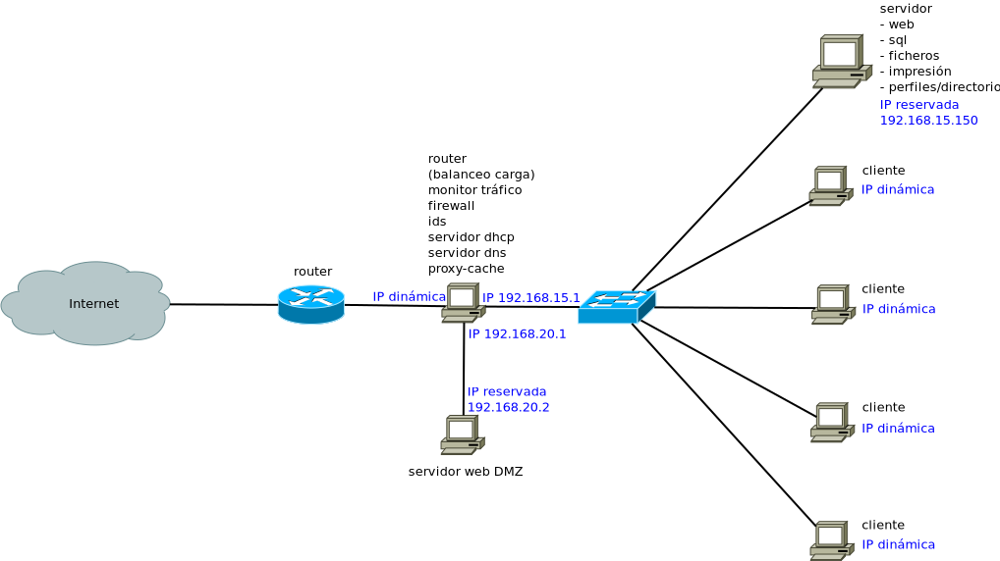
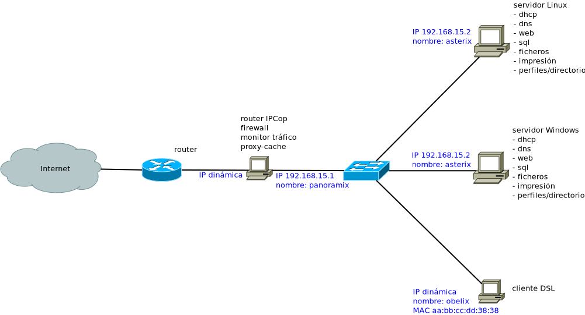

Planificación de la red y servicios
===================================

Problemática
------------

Nuestro centro educativo ha ido creciendo en los últimos años. Actualmente el número de profesores y alumnos es elevado y todos utilizan las nuevas tecnologías de la información en su tarea diaria.

También ha crecido el número de equipos informáticos puestos a disposición de la comunidad educativa, tanto en número de equipos por aula, como en número de aulas y departamentos. El número de alumnos que pasa por ellas es elevado y las diferentes configuraciones, fruto de la utilización inadecuada de los equipos, dificultan las tareas de mantenimiento y de aprendizaje.

Se dispone de la instalación física de la red, pero no se obtiene el rendimiento adecuado de la misma, ni se explota al máximo su estructura.

Por todo ello, y como responsables de las TIC en el centro, decidís reestructurar el sistema de información interno, para crear una verdadera intranet y poder administrarla, dado que la situación actual resulta poco manejable.

Preguntas
---------

 01. Fruto del crecimiento informático del centro y de la utilización cada vez más frecuente de dichos recursos informáticos resulta que la información se encuentra fragmentada en muchos lugares, el acceso a ella es complejo y lento y, en multitud de ocasiones se accede a información desfasada o ésta se ha perdido. ¿Qué actuaciones harías?

     **Se propone la instalación de un servidor central que proporcione acceso a la información, independientemente de donde se encuentre el usuario y que sea accesible para toda la comunidad educativa. Para ello, la información se centralizará en el servidor y se implantarán credenciales de autentificación, de tal forma que, a partir del perfil que se tenga, se pueda acceder a unos recursos o a otros, garantizando la integridad y seguridad en el acceso.**

 02. Es fundamental que el servidor sea un equipo al que no se pueda acceder para ejecutar programas o para realizar una tarea urgente. Sin embargo, es un hecho que se accede a los ordenadores críticos (secretaría, dirección, administración, etc) para urgencias de impresión, consultas u otras causas, con el consiguiente peligro de corrupción y borrado accidental de archivos. ¿Qué actuaciones harías?

     **Se propone que, una vez instalado y configurado el ordenador servidor, éste se aisle en un despacho próximo a secretaría o dirección, con la prohibición expresa de su utilización. Para las tareas de administración de la red, el coordinador de TIC utilizará una conexión remota.**

 03. Por otro lado, tanto el profesorado como el alumnado acostumbran a personalizar su escritorio, incluyendo accesos directos, carpetas y demás vínculos que considera importantes y cómodos en su tarea diaria. Pero todo ésto incomoda en muchas ocasiones a otros usuarios que también utilizan el mismo equipo. Esta situación es especialmente patente en las aulas de informática, donde parece que el alumnado compite en crear ámbitos de trabajo extravagantes e inútiles, con la consecuente pérdida de tiempo en la carga del sistema operativo. ¿Qué actuaciones harías?

     **Se propone la gestión centralizada de los usuarios del centro, tanto de profesorado como alumnado. La información se guardará en el servidor y será accesible independientemente del ordenador utilizado. De esta forma se dispondrá de un entorno de trabajo individualizado que se vinculará al usuario, siendo independiente del equipo que se quiera utilizar.**

 04. En algunos momentos el tráfico de la red es enorme, habiéndose detectado problemas de congestión sin saber el motivo y consecuentemente, sin poder tomar medidas para restablecer la normalidad. También se ha observado la tendencia a los cambios de configuración del alumnado de las direcciones IP, máscaras, puertas de enlace y direcciones DNS asignadas, lo que conlleva problemas de conectividad e inseguridad. Volver a realizar las configuraciones lleva demasiado tiempo. En ocasiones se produce el cambio de direcciones DNS por parte del proveedor, lo que implica un periodo de tiempo importante sin conexión, hasta conseguir volver a configurar totalmente los equipos. ¿Qué actuaciones harías?

     **Se propone la instalación de un servidor DHCP y DNS que además sea la puerta de salida a todas las conexiones externas, de tal forma que cualquier cambio en la configuración del proveedor se resuelva en el servidor y los cambios del alumnado se resuelvan simplemente reiniciando el equipo. También permitirá el análisis del tráfico de la red al pasar todas las comunicaciones entrantes y salientes por el servidor.**

 05. El secretario del centro reiteradamente ha advertido que el gasto en fotocopias es elevado y, por lo tanto, es necesario tener un control de lo que se imprime y de su destino. Recientemente se ha suscrito un contrato con una empresa de reprografía que ha instalado en alquiler una impresora de red y se quiere que una gran parte de la impresión se realice a través de dicha impresora, dadas las ventajas económicas que supone frente al coste de los fungibles de las impresoras locales. ¿Qué actuaciones harías?

     **Se propone la instalación de la impresora de red para poder realizar el control que el secretario exige aunque sin rechazar la instalación de impresoras locales donde sea necesario.**

 06. La información existente debe ser salvaguardada de los desastres que habitualmente ocurren: virus, fallos de hardware, borrados accidentales y/o provocados, etc., máxime cuando se está llevando a cabo un sistema centralizado de información donde, además de los datos generales, se almacenan los perfiles y las carpetas personales de los usuarios. ¿Qué actuaciones harías?

     **Se propone la creación de un sistema de copias de seguridad automatizado que evite las pérdidas de información.**

 07. Muchos profesores se encuentran realizando cursos de aprendizaje y perfeccionamiento relacionados con las Nuevas Tecnologías (cursos de html, php, mysql, etc) y necesitan soporte para su desarrollo. ¿Qué actuaciones harías?

     **Se propone la instalación de software servidor web apache para facilitar y potenciar el aprendizaje del profesorado, permitiendo el uso de lenguajes de script (php) así como del acceso a bases de datos (MySQL). Se habilitará además un espacio web para el profesorado que lo solicite donde pueda hacer uso de todas estas herramientas y un servidor FTP.**

 08. Se ofrecerá a los profesores, como complemento a los Servicios Web prestados a los usuarios del centro, acceso a carpetas privadas y seguras (acceso https) disponibles vía web mediante autentificación. ¿Qué actuaciones harías?

     **Se propone la instalación de servidores de certificados (Entidad Certificadora OpenSSL,...) para el acceso a dichas páginas web seguras, de forma que se garantice la seguridad y privacidad de los datos allí alojados.**

Práctica
--------

Idealmente me gustaría un montaje parecido a éste:

Pero este curso tendremos un montaje más parecido a éste otro (cuando esté encendido el servidor Linux entonces el servidor Windows estará apagado, y viceversa):

